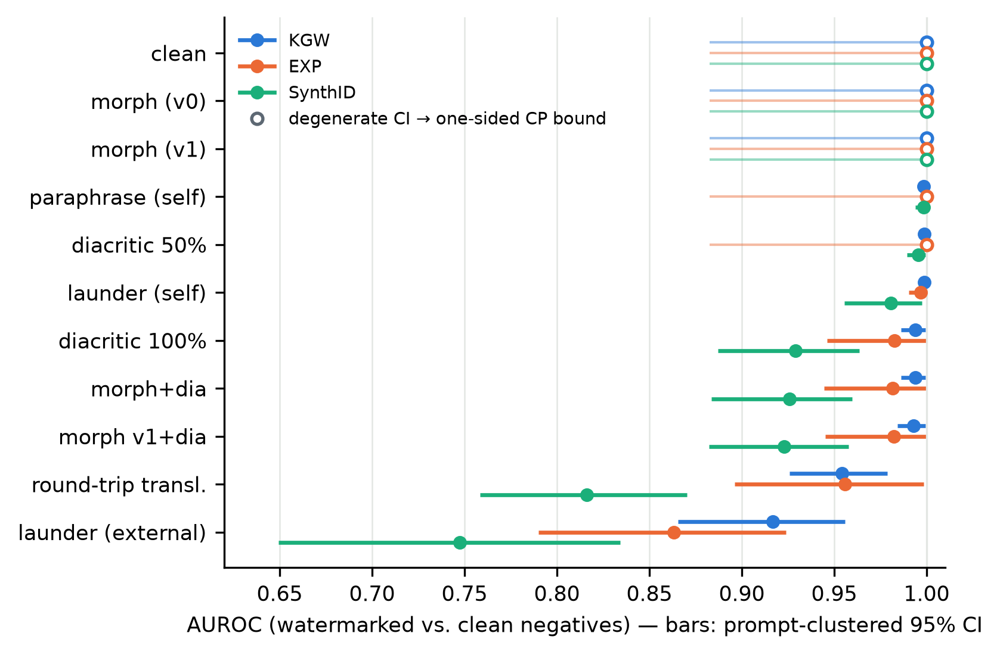
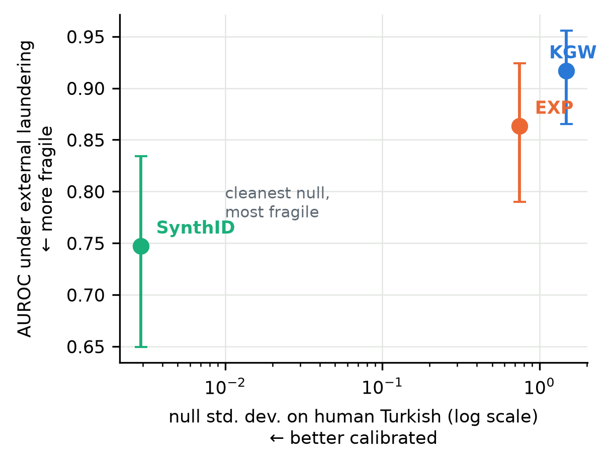
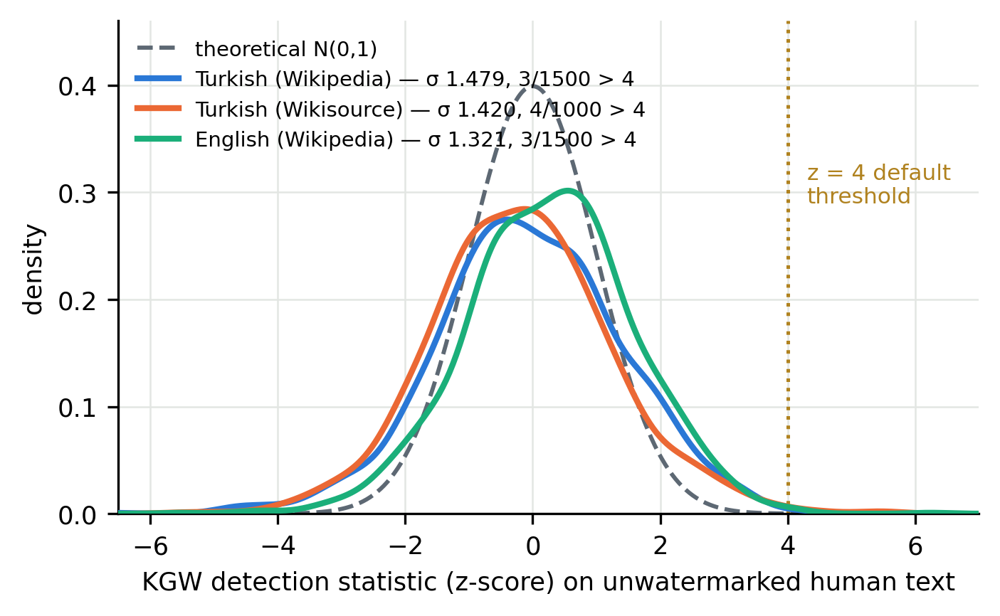

# Watermarking Turkish LLM Output: Detector Calibration, Scheme Fragility, and a Released Evaluation Benchmark

**Corresponding author:** Ali Çetinkaya, Department of Computer Engineering,
Faculty of Technology, Selçuk University, Alaeddin Keykubat Campus, 42075
Selçuklu, Konya, Türkiye. E-mail: ali.cetinkaya@selcuk.edu.tr ·
Tel: +90 332 241 11 02 · ORCID: 0000-0002-7747-6854

## Abstract

Statistical watermarks for large language model (LLM) output are evaluated predominantly on English. We measure three schemes (KGW, EXP, SynthID) on Turkish with MarkLLM and Qwen3-14B: 384 generated texts under ten removal attacks, a pre-registered false-positive study on 4,000 windows of human-written encyclopedic and older literary prose, and a two-judge meaning-preservation study. First, KGW's detector is miscalibrated on that human text: its null standard deviation is 1.479 against a theoretical 1, and the shipped z = 4 threshold gives 3 exceedances in 1,500 windows, about 63 times nominal (exact interval 13 to 184). The inflation holds across eight keys though the tail count does not (3 to 143), and it is not Turkish-specific: English shows the same tail count, and at matched token length we detect no difference. Turkish increases exposure to the same failure. Its subword fertility doubles the tokens a given reading length becomes, and inflation grows with tokens scored. Second, the detector flagging the fewest human windows is the most fragile: at its shipped threshold SynthID flags none of 1,500 against KGW's 3 and EXP's 13, yet loses the most area under the receiver operating characteristic curve (AUROC) under attack. With three schemes this is an observed pattern, not a trade-off. Third, laundering through an external LLM is the only attack degrading detection for all three schemes while LLM judges rated meaning preserved, though only KGW-arm pairs were judged. A planned morphological attack did not fire. We report its coverage and release corpus, scores and annotations.

**Keywords:** LLM watermarking; Turkish; detector calibration; false-positive rate; subword fertility; evaluation benchmark

## 1 Introduction

Statistical watermarking embeds a detectable but, ideally, quality-neutral signal into the sampling process of a large language model, so that a detector holding the key can later test whether a given text was produced by the watermarked model. The main scheme families are logit-biasing green-list watermarks (Kirchenbauer et al., 2023), distortion-free Gumbel-sampling watermarks (Aaronson, 2023; Aaronson & Kirchner, 2022; Kuditipudi et al., 2024), and tournament-sampling SynthID, which has been deployed at scale (Dathathri et al., 2024). In all three, detection is a hypothesis test: the detector computes a statistic whose distribution on unwatermarked text is assumed known, and a threshold (for KGW, a z-score threshold) is chosen for the false-positive rate that this null implies. The practical value of a watermark rests on that calibration. If the null distribution on real, unwatermarked text is wider than assumed, the advertised false-positive rate is wrong, and every downstream decision that consumes the detector's verdict (academic-misconduct cases, provenance labelling, content-policy enforcement) inherits the error.

These schemes were developed and are evaluated mostly on English (Al Ghanim et al., 2025; He et al., 2024). Turkish differs from English in a way that plausibly reaches into watermark internals: it is agglutinative, expressing through chains of suffixes what English expresses through separate function words. Under a subword tokenizer these suffixes surface as a small set of high-frequency subtokens. On our corpus the generator's tokenizer produces 2.552 tokens per word. For a green-list scheme whose pseudo-random vocabulary partition is keyed on a context window of a single preceding token (prefix_length = 1, the MarkLLM default configuration we test), recurring suffix subtokens mean that successive green-list decisions revisit the same partitions and are no longer independent. We put this forward as a proposed mechanism for the calibration results below. We do not claim to have established it causally.

This paper reports a pilot-scale but tightly instrumented measurement of the three schemes on Turkish. Using MarkLLM (Pan et al., 2024) at a fixed commit (c45ddc40) with Qwen3-14B (Yang et al., 2025) as generator, we build a corpus of 24 Turkish prompts × 4 seeds × {no watermark, KGW, EXP, SynthID} = 384 texts and subject it to ten removal attacks: diacritic stripping at two intensities, two morphological-transform variants built on the zeyrek analyser (Bulat, 2022) together with their diacritic combinations, round-trip translation through English with NLLB (NLLB Team et al., 2024), self-paraphrase and self-laundering by the generator itself, and laundering through an external, closed-weight LLM outside the defender's control (Claude Opus 5). Two studies were pre-registered before their data were collected. We use that term in
a specific and limited sense throughout, and Section 7 gives the full statement: the
hypotheses, protocol and decision rule were committed to version control before the
corresponding data existed, and the commit hashes bind their content and ordering, but
no independent third-party timestamp anchors the dates, so this is not a registry
entry in the sense the term carries in clinical or psychological research. The two
studies are: S1 measures false-positive rates on 1,500 Turkish and 1,500 English human-written Wikipedia excerpts (Wikimedia Foundation, 2023a; commit 8f8df72), and S2 measures whether attacks preserve meaning, using two LLM judges from different model families, blind calibration pairs, and a decision rule declared before the run (commit cbcb988). Corpus acceptance thresholds were fixed before Phase 1. The measurement protocol accounts for the corpus's dependence structure. Because EXP is deterministic given prompt and key, its four seeds are not independent replicates, so all confidence intervals are prompt-clustered bootstrap intervals (effective n = 24 prompts). For degenerate AUROC = 1.000 cells we report counted separation and its margin descriptively, attaching no p-value or confidence bound, and Section 3.3 explains which three inferential treatments we withdrew and why. We also report the full realized false-positive table, since a threshold calibrated on clean negatives need not keep its nominal rate under attack.

Three findings follow, and because each is bounded in a different way the contribution list below states each with its own scope. The headline is a calibration failure on human Turkish: the KGW null standard deviation is 1.479 against a theoretical 1, and the shipped z = 4 threshold flags 3 of 1,500 excerpts, roughly 63 times nominal. Two of the three pre-registered S1 hypotheses are confirmed. The third, which attributed the inflation to Turkish rather than English, does not survive a length control we added after pre-registration, so Turkish worsens a failure common to both languages instead of creating a Turkish-specific one.

We also report a negative result. The study was originally motivated by the conjecture that Turkish morphology would itself furnish a meaning-preserving removal attack. It does not, on this corpus. The transforms target progressive -(I)yor forms that the formal register the generator produces rarely contains, so coverage is too low to move detection at all. Section 6 gives the edit counts, the surviving v0 slope and the retracted v1 slope. Whether informal-register Turkish is more vulnerable is an open question, not a finding of this paper.

The remainder of the paper is organized as follows. Section 2 reviews related work. Section 3 describes corpus construction (including the prompt-length calibration), the attack suite, and the measurement protocol. Section 4 presents results: clean-text detection, the attack ordering, the S1 calibration study, and the S2 utility study. Section 5 discusses practical consequences and the threat model. Section 6 lists limitations in full, including the single generator model and single GPU environment, and Section 7 states the reproducibility provisions. In sum, this paper makes the following contributions:

1. **Calibration failure on human text, measured on Turkish (pre-registered, commit 8f8df72).** The KGW detector's null distribution on human Turkish has standard deviation 1.479 against a theoretical 1, and the default z = 4 threshold produces an empirical false-positive rate of 0.002 (3/1,500), approximately 63× nominal (exact interval 13×–184×). The inflation holds under all eight watermark keys we swept, though the tail count ranges from 3 to 143 across them, so the headline figure is the most conservative of the eight. Controlling for token length shows the effect is not Turkish-specific but length-driven, with Turkish exposed further along the same curve through subword fertility. An exploratory follow-up shows that thresholds calibrated on model-generated negatives reach up to 7.4% FPR on human text. Default thresholds are portable neither across negative distributions nor across document lengths.
2. **The detector with the lowest human-text flag rate is the most fragile.** At its own shipped threshold SynthID falsely flags none of the 1,500 human Turkish windows, against 3 for KGW and 13 for EXP, but it takes the largest attack losses (AUROC 0.816 under round-trip translation, 0.747 under laundering), and is the more fragile scheme in all four of the six paired comparisons it enters, each with a Holm-adjusted p below .05 within that six-test family (the family was fixed before the per-scheme results were seen, and the two attack conditions were designated on an independent pilot cohort, Section 3.3). KGW and EXP are not separated by these data.
3. **The laundering attack (utility axis pre-registered, commit cbcb988).** Rewriting through an external LLM is the only attack among ten whose detection damage clears the pre-declared threshold for all three schemes: AUROC falls to 0.917/0.863/0.747 and TPR at the clean-calibrated threshold to 0.427/0.490/0.250 for KGW/EXP/SynthID, at a measured attack cost of USD 17.704. The utility half of the rule is established only for KGW, because every judged pair was drawn from the KGW arm. Meaning was preserved in 1.00 of those pairs under both judges. Extending the verdict to EXP and SynthID assumes that meaning preservation transfers across arms, and we mark it as an assumption.
4. **A documented negative result and the measurement protocol.** The planned Turkish morphological attack does not fire on formal-register model output (1.1 edits per text on average, 60.4% of texts unchanged, ΔAUROC 0.000), and the morph_v1 per-edit slope is retracted after robustness testing. Every reported number regenerates from data via code, and an automated check compares the manuscript's two inferential tables against that output cell by cell. Confidence intervals are prompt-clustered. Degenerate cells report counted separation descriptively, with no p-value attached. Exploratory observations are labelled as exploratory, and where a later control overturned a pre-registered conclusion we report the reversal.
## 2 Related Work

Three families of decoding-time watermarks dominate current practice. The green-list scheme of Kirchenbauer et al. (2023) pseudorandomly partitions the vocabulary at each step using a hash of the preceding context and adds a bias delta to the logits of "green" tokens. Detection is a one-proportion z-test whose null model treats successive green/red outcomes as independent Bernoulli trials with parameter gamma. The exponential-minimum (Gumbel-trick) approach proposed by Aaronson and Kirchner (2022; see also Aaronson, 2023) couples token selection to a pseudorandom sequence keyed on the context, leaving the sampling distribution unchanged in expectation. Kuditipudi et al. (2024) develop distortion-free variants of this idea with robustness guarantees for the detector. SynthID (Dathathri et al., 2024) modifies sampling through a tournament procedure and has been deployed at production scale. All three report detection behaviour primarily on English text, and the calibration of their detection thresholds (the mapping from a score threshold to a false-positive rate on unwatermarked text) inherits distributional assumptions that were validated, where they were validated at all, on English.

Watermark evaluation already has benchmarks, and this paper is not the first. WaterBench (Tu et al., 2024) equalizes watermark strength before comparing schemes and evaluates generation and detection across nine tasks. Mark My Words (Piet et al., 2025) scores schemes on quality, the number of tokens needed for detection, and tamper resistance. WaterPark (Liang et al., 2025) assembles ten watermarkers against twelve attacks in one platform. All three are cross-scheme and English-centred, and all three calibrate against model-generated negatives. We add a human-written negative distribution in a language none of them covers, together with register, token-length and watermark-key controls on that distribution, an axis orthogonal to theirs. Our contribution is therefore specific to one language and one negative distribution and does not amount to a more general benchmark. External rewriting, black-box removal, translation-based removal and character-level attacks all have direct antecedents (Section 2, below), and so does the use of Turkish morphology to manipulate a watermark. TR-WM-EVAL contributes a documented Turkish evaluation resource that combines human negatives at deployment length, a measurement of whether model-calibrated thresholds transfer to them, ten post-generation transformations, prompt-cluster-aware inference, and per-path licensing documentation, for three tested watermark configurations.

We build on the MarkLLM toolkit (Pan et al., 2024), which provides reference implementations and detectors under a common interface. Its published version documents the KGW and Christ families, and SynthID was added to the repository afterwards, so all three of our schemes are taken from the pinned repository state. All experiments pin MarkLLM commit c45ddc40 so that scheme behaviour is reproducible at the code level.

A separate line of work studies robustness of watermarks to post-hoc text transformations, in particular paraphrasing and translation (He et al., 2024; Krishna et al., 2023; Sadasivan et al., 2025). Every attack family we run has an antecedent there, and none of them originates here. Removal without knowledge of the scheme is established: B⁴ formulates black-box scrubbing as a constrained optimization over a watermark distribution and a fidelity distribution, assuming knowledge of neither the watermark type nor its hyperparameters (Huang et al., 2025), and De-mark removes n-gram watermarks by probing the model with queries to recover the red–green partition (Chen et al., 2025). Our launder_api is a far cruder member of that family: a single rewriting pass, with no optimization and no probing. Translation-based removal is likewise established, both as round-trip translation (He et al., 2024) and as cross-lingual summarization (Ganesan, 2025). So is the character-level family our diacritic-stripping attacks belong to: Z. Zhang et al. (2026) show that character-level edits such as typos, swaps and homoglyphs are disproportionately effective because they disrupt tokenization, so a single edit shifts many tokens at once. The Turkish-specific part is the ecology: writing ç, ğ, ı, ö, ş, ü as ASCII is ordinary keyboard practice, so the perturbation arrives in ordinary text at rates an attack model would not predict. On this axis we therefore contribute a measurement of known attack families on a language where their linguistic preconditions differ, under a pre-registered decision rule that requires meaning preservation and not only detection loss, and with self-laundering separated from laundering through an external model.

Work on watermarking outside English is thin but no longer absent, and most of it is recent: cross-lingual consistency of the watermark signal under translation (He et al., 2024), robustness under real-world cross-lingual manipulation (Al Ghanim et al., 2025), a linguistics-aware scheme that modulates watermark strength by syntactic predictability and is evaluated on analytic English, isolating Chinese and agglutinative Korean (Park et al., 2026), a back-translation search that restores watermark strength in medium- and low-resource languages and traces the failure it repairs to tokenizers with too few whole-word tokens (Mohamed & Gubri, 2025), and a cross-lingual fairness audit over six schemes and eleven languages, Turkish among them (Nemecek et al., 2026). Two things that literature does not yet supply are a null distribution measured on human text and an agglutinative language other than Korean under typological scrutiny. Turkish is also a language whose resources have been surveyed critically: Çöltekin et al. (2023) catalogue the available corpora and lexical resources and document persistent gaps in accessibility, licensing and register coverage, which is part of why we release the evaluation material here as a documented resource. Turkish is a stress case for the assumptions above: it is agglutinative, with long suffix chains governed by vowel harmony, and subword tokenizers over-segment it relative to English. Rust et al. (2021) report that mBERT's subword fertility and its proportion of words split into more than one subword are both far higher for Turkish than for English. Whether that over-segmentation also makes particular suffix subtokens recur often enough to disturb a watermark's null model is a separate question, which Section 4.3 measures. Repeated suffix subtokens provide a candidate mechanism for interaction with context-hash schemes such as KGW when the hashing window is short. Turkish morphology has in fact already been used to carry a watermark rather than to remove one. Meral et al. (2009), working on Turkish at Boğaziçi University, embed a watermark in natural-language text through morphosyntactic alteration, and their design turns on the same property we exploit: an agglutinative language affords many surface forms that leave the content intact. Their work long predates decoding-time statistical watermarking and pursues the opposite operation (they alter morphology to insert a signal, we alter it to strip one), but it is the closest linguistic antecedent to our morphological attack, and using Turkish morphology to manipulate a watermark is not new here. Morphological analysis for Turkish is available through the zeyrek analyser (Bulat, 2022), an alpha-stage partial port of Zemberek, which we use to build that attack and, in the re-inflection variant only, to check that the edited form still parses to the same lemma. That check certifies word-level morphological analysability, not sentence-level grammaticality. Section 3.2 states the limit and the subordinate-clause variant carries no analyser check at all. The closest antecedent, however, calibrates against model output: the null sets of Nemecek et al. (2026) are matched-prompt unwatermarked generations. We are aware of no published measurement of watermark detector calibration on Turkish text *written by humans*, the negative class a deployed detector actually screens and one that Section 4.3 shows model negatives do not stand in for, since a threshold set to 1% false positives on model negatives realizes 7.4% on human Turkish. Sections 4–5 report one.
## 3 Methods

### 3.1 Corpus construction

The generation corpus crosses 24 Turkish prompts with 4 sampling seeds and 4 arms (no watermark, KGW, EXP, and SynthID) for 384 texts, 96 per arm. The prompt file is content-addressed (SHA-256 prefix 8fcbe4074b46). Prompts cover expository topics and request essays of at least 500 words. The generator is Qwen3-14B (Yang et al., 2025) in fp16 on a Quadro RTX 8000 (Turing), driven through MarkLLM commit c45ddc40 (Pan et al., 2024). Sampling uses temperature 0.8, top_p 0.95, top_k 20, repetition penalty 1.0, max_new_tokens 1800, and min_new_tokens 400. Two implementation details matter for cross-scheme comparability. SynthID applies temperature inside its own logits processor, so the Hugging Face temperature is disabled for that arm to avoid applying temperature twice and keep the effective temperature equal across schemes. The SynthID processor state is also reset before every generation, since the toolkit otherwise carries state across samples and makes output depend on generation order. Bit-identical regeneration under fixed seeds was verified on the target GPU. This is a single-environment reproducibility statement, not a portability claim.

Scheme configurations follow the toolkit defaults. KGW uses gamma 0.5, delta 2.0, prefix_length 1, and detection threshold z = 4 (Kirchenbauer et al., 2023). EXP (Aaronson, 2023; Aaronson & Kirchner, 2022) generates a fixed sequence_length of 950 tokens, does not consume the sampling kwargs above, and never stops at an end-of-sequence token. SynthID (Dathathri et al., 2024) uses the mean detector without a trained scoring layer.

Prompt calibration is easy to misread as threshold tuning, so the sequence is set out here. In a preflight run whose prompts requested at least 300 words, the model delivered a median of 244 words, below the acceptance criterion. With prompts requesting at least 500 words, the median rose to 364. The prompts were therefore recalibrated to request 500 words, while the acceptance criterion itself stayed at 300 words. It was fixed, together with all corpus acceptance thresholds, before Phase 1 and before any corpus data was seen (pre-registered in the repository). The calibration changed the instruction and left the bar unchanged. Measured tokenizer fertility on this corpus is 2.552 tokens per word, so the 1800-token budget covers the 300-word criterion with a wide margin.

The pre-registered acceptance thresholds are: at least 300 words per text with corpus-level compliance of at least 0.75, terminal punctuation at the end of at least 0.90 of texts, and non-Latin-script contamination in at most 0.05 of the corpus (above which the quality layer is retracted). The realized corpus passes all three (Table 1): 375/384 texts (97.7%) meet the word criterion, and 283/288 (98.3%) end in terminal punctuation. EXP is structurally exempt from the termination criterion (it emits a fixed-length sequence by design and cannot stop at a sentence boundary), so its 96 texts are removed from that denominator (hence 288). The 0.90 and 0.05 values were fixed before the data but are not externally justified, and no sensitivity analysis was run (see Limitations).

**Table 1.** Corpus statistics per arm.

| arm | n | median words | median tokens | non-Latin contaminated | at 1800-token ceiling |
|---|---|---|---|---|---|
| no watermark | 96 | 365 | 935 | 2 | 0 |
| KGW | 96 | 382 | 983.5 | 8 | 2 |
| EXP | 96 | 376 | 947 | 0 | 0 |
| SynthID | 96 | 371.5 | 950.5 | 9 | 2 |

The pooled contamination rate stays below the 0.05 ceiling, so the quality layer is retained. The per-arm contamination counts and the four ceiling-truncated texts are revisited in the Limitations. The token-length standard deviation of the EXP arm is 1.5 tokens (versus three-digit values in the other arms), the signature of its fixed-length design. Token counts are logged per text so that length can be inspected as a confounder in every analysis.

### 3.2 Attacks

Ten transformations are applied to every positive text and, in parallel, to every negative text (the attacked negatives feed the false-positive analysis of Section 3.3). All attacks are seeded for reproducibility.

Diacritic stripping maps the Turkish-specific characters ç, ğ, ı, ö, ş, ü (and uppercase forms) to their ASCII counterparts: dia100 converts every occurrence, while dia50 converts each occurrence independently with probability 0.5, imitating informal keyboard usage. The morphological attacks generate candidate edits by rule. The re-inflection transform accepts an edit only if the zeyrek analyser (Bulat, 2022) re-parses the result to the same lemma. The subordinate-clause alternation is a purely regular substitution with no analyser check, although its edits are counted the same way. Same-lemma reparsing is a filter, not a guarantee of grammaticality or of preserved meaning, and we did not validate the edits with human annotators. The transforms are as follows. morph (v0) applies a progressive-to-formal re-inflection (-Iyor to -mAktAdIr) and a subordinate-clause alternation. morph_v1 also drops copular suffixes, raising coverage. Measured coverage is low by construction of the register the model produces: morph makes a mean of 1.14 edits per text with 60.4% of texts receiving zero edits, while morph_v1 makes 7.52 edits per text with 4.2% zero-edit texts. The combinations morph+dia and morph_v1+dia compose each morphological attack with full diacritic stripping. rtt is round-trip translation Turkish–English–Turkish with NLLB-200-distilled-600M (NLLB Team et al., 2024), translated sentence by sentence. para and launder are self-rewrites by the generator itself with the watermark processor disabled: para instructs a light paraphrase preserving sentence order, launder a complete rewrite "in your own sentences", a zero-cost laundering model. launder_api is real laundering through an external LLM outside the defender's control (Claude Opus 5) via its API. We call it external rather than stronger, because we ran no benchmark that would license a capability ordering. Its measured generation cost for the full corpus, USD 17.704, is reported because attack economics are part of the threat model.

Because rewriting attacks can shorten text, and detector statistics scale with length (for KGW the z-score grows roughly with the square root of token count), any detection loss could in principle be a length artefact. We therefore report the attacked-to-source token-length ratio for the rewriting attacks, computed on the KGW-watermarked arm: para has median ratio 0.992 (minimum 0.669), rtt 0.899 (minimum 0.781), and launder_api 0.976 (minimum 0.541). Pooled over all four arms the minima are lower, 0.321 for rtt and 0.146 for launder_api, both occurring in the SynthID arm, so the reassurance the medians provide is weaker in the tail than these three numbers alone suggest. The most damaging attack, launder_api, barely shortens text at the median, and rtt shortens it by about 10%. Under square-root scaling this bounds the length contribution well below the observed drops, so shortening cannot account for the bulk of the effects reported in Section 4. An earlier pilot version of the rewrite attacks had a fixed output cap that halved text length and would have manufactured this artefact. The cap is now derived from the generation budget, and the episode is a caution for replication.

### 3.3 Detection measurement

The primary metric is AUROC of the detector statistic, computed per scheme and condition from the 96 attacked positives against the 96 clean negatives. Confidence intervals come from a nonparametric bootstrap that resamples prompts instead of rows. Analytic intervals for this estimand exist (Newcombe, 2006), but they assume independence within each class and lose their coverage at the boundary values that the degenerate cells reported in Section 4.1 occupy, so we resample throughout and, for those cells, report counted evidence in place of an interval. The rationale is an audit finding: EXP derives its pseudorandom key from the final prompt token(s) rather than from the torch generator, so under deterministic transformations its four seeds produce identical outputs. The four "replicates" are one measurement, and the effective number of independent units is the 24 prompts. Row-level resampling would understate uncertainty for EXP. Prompt-clustered resampling is applied to all three schemes because the inferential target throughout is generalization to new prompts, not new samples of the same prompts.

Eleven cells reach AUROC 1.000 with a degenerate bootstrap interval of [1, 1]. A degenerate interval does not mean the absence of uncertainty. It means no counterexample was observed. For these cells we report the separation descriptively and attach no p-value and no confidence bound (Section 4.1): the count of prompt clusters that separate completely, whether separation also holds globally, and the width of the gap in units of the clean-negative standard deviation. In all eleven cells every one of the 24 clusters separates, and the lowest watermarked statistic exceeds the highest of the 96 clean negatives. We report the margin because it differs by nearly two orders of magnitude across schemes, and presenting the cells as interchangeable would obscure that. It is 53.23 negative standard deviations for EXP on clean text but only 0.74 for KGW, so KGW's perfect separation is far more precarious than EXP's even though both round to 1.000.

Three successive inferential treatments of these cells were withdrawn during preparation, and the rule above is what survives. A one-sided Clopper–Pearson bound of 0.883 was withdrawn because Clopper–Pearson bounds the parameter of a binomial proportion whereas AUROC is a pairwise-ranking U-statistic (Bamber, 1975), so a cluster-level event probability is neither equal to nor a lower bound on the population AUROC. A within-prompt label-exchangeability permutation giving 10⁻⁴⁴·³ was withdrawn because exchangeability is not defensible for a scheme whose four seeds are deterministic. A prompt-level sign test giving 2⁻²⁴ was withdrawn because its 0.5 null is not derived from the design and because all 24 outcomes are compared against the same data-dependent comparator, the maximum of the pooled clean negatives, so they share a common random component and cannot be multiplied. A valid test here would have to permute labels at a unit whose exchangeability can be argued and recompute the comparator inside every permutation. We did not run one. The full derivation of each withdrawal is in the repository audit note `DENETIM_NOTU_geri_cekilen_cikarimlar.md`, and a build-time check fails the release if any of these quantities reappears in a generated artefact.

A detection threshold is set on the clean negatives at their 1% false-positive point, and we report the true-positive rate at this clean-calibrated threshold, not "TPR at 1% FPR", because under attack the negatives are transformed too and the realized false-positive rate at that threshold is an empirical question. The full 33-cell table (3 schemes by 11 conditions, the untransformed clean reference included) of realized FPR at that threshold on the corresponding negatives is reported as Online Resource 1, with one-sided binomial comparisons against the nominal rate under Bonferroni correction across the 33 cells. Those comparisons treat the 96 attacked negatives in a cell as independent, which they are not. They are four per prompt across 24 prompts, and the threshold is itself estimated from the 96 clean negatives. We therefore read the table descriptively and do not rest any conclusion on its cell-level significance. At n = 96 the FPR resolution is 1/96, which motivates Study S1 (Section 3.4). As a robustness check we also report the same-transformation AUROC, in which both classes are transformed. This is ecologically meaningful for diacritic stripping and round-trip translation (which occur in natural text) but not for laundering (no one launders human text to remove a watermark), so the headline remains the clean-negative AUROC.

Cross-scheme comparisons never compare raw statistics, whose scales are incommensurable. The unit is the per-prompt detection rate at each scheme's own clean-calibrated threshold. The test family was specified before the per-scheme results were inspected: {rtt, launder_api} crossed with the three scheme pairs, six paired Wilcoxon tests at prompt level (n = 24), Holm-corrected. The two conditions carried into the focused comparisons, rtt and launder_api, were not chosen on the study data. They were the two most destructive attacks in an earlier pilot cohort generated with a different model (Qwen2.5-3B-Instruct) that failed the corpus acceptance gate, and the pilot report designated them as such in writing before the study corpus was generated. The pilot report, its detection table and its environment record are released as audit material (`audit/pilot_20260818/`). The pilot corpus itself is not. That report designates the pair but declines to order it: its own paired test separated launder_api from rtt in no scheme, and it records the withdrawal of an earlier ranking claim as an artefact of a selected minimum point estimate. The pilot therefore fixes which two conditions are compared and does not anticipate the direction that the within-scheme comparison of Section 4.2 estimates. Two limits of that record are stated with it. Its timestamps are local files, as for the pre-registrations (Section 7). And the analysis code that fixes the pair was written after the study corpus had been scored, so the record shows that the designation preceded the study data but cannot show that the study's own aggregate ranking, reported in Section 4.2, which reproduced the ordering of the pilot's point estimates, played no part in confirming it. Selection on data disjoint from the test data does not inflate the type I error of the test, whatever the quality of the selecting cohort. Had those point estimates been uninformative, the pair carried forward would have been an arbitrary one and the comparisons on the study corpus would still be valid, only less likely to detect anything. We therefore treat the pair as fixed on data disjoint from the data the comparisons are computed on, report the multiplicity adjustments of Section 4.2 as familywise within their displayed families, and state this provenance in place of either a full pre-specification claim or a post-selection label. The test family built on the pair was fixed before the per-scheme results were seen. For the scheme-pairwise comparison the point is moot in any case: the pilot ranking averages over schemes, whereas those tests compare schemes within a condition, so the quantity that designated the conditions is not the quantity being tested. Within each scheme, rtt and launder_api are compared on the same unit: the per-prompt detection rate at that scheme's own clean-calibrated threshold, with Bonferroni correction across the three schemes (α = 0.05/3 ≈ 0.0167). Because each rate is computed over four seeds it can take only five values, so ties and exactly-zero differences are common (6 to 11 of 24 pairs, depending on the scheme). We therefore report a two-sided exact paired sign-flip permutation test as the primary p-value, conditional on within-prompt exchangeability of the two attack outcomes. That exchangeability is an assumption. The two conditions are substantively different transformations, not randomly assigned labels, so exchangeability is a modelling assumption about the null and not something randomization delivers. The pairing does supply what the withdrawn test of the degenerate cells lacked: a matched unit (swapping the two conditions within a prompt maps onto flipping the sign of that prompt's difference) and a comparator that is invariant to the swap. Alongside it we report a Wilcoxon signed-rank test using Pratt's convention, which ranks zero differences rather than discarding them. We also report the mean rate difference with a prompt-clustered bootstrap interval, because a p-value alone does not convey the size of the effect. That interval resamples prompt clusters jointly across the clean negatives and both attack arms and re-derives the threshold inside every replicate, so it carries the uncertainty of the calibration sample. The permutation p-value remains conditional on the observed calibration sample. An earlier version of this comparison ran on the per-prompt mean raw statistic instead. That test is internally valid (within a scheme the scale is fixed), but it estimates mean detector-score displacement, not the change in detection at the operating threshold that the surrounding text describes. Correcting the unit changes which scheme survives correction. Row-level McNemar tests are retained only descriptively because they violate the independence structure identified above.

### 3.4 Study S1: false-positive rate on human text

S1 asks whether the detectors flag unwatermarked human Turkish, and whether the effect is specific to Turkish. It was pre-registered (commit 8f8df72) before any human-text data was collected, with three hypotheses. H1: the KGW null standard deviation on human Turkish exceeds 1 (the variance inflation seen on model negatives is not an artefact of model text). H2: the inflation on a matched English sample is smaller than on Turkish. H3: EXP and SynthID nulls show no comparable inflation (SynthID's null standard deviation predicted ≈ 0.003). The registered motivation came from the 96 model negatives: the KGW null there has mean 0.012 and standard deviation 1.313, placing the shipped threshold z = 4 (nominal one-sided false-positive rate 3.17 × 10⁻⁵ under the N(0,1) null; Kirchenbauer et al., 2023) only 3.04 standard deviations from the observed mean.

The sample is drawn from the Wikipedia dump of 2023-11-01 (Wikimedia Foundation, 2023a): random Turkish articles and a matched English set, one contiguous window per article, length-matched to the generation corpus, never cut mid-sentence, with page identifiers recorded for exact re-retrieval. The pre-registration targeted at least 1000 documents per language. The achieved n is 1500 per language. All three detectors run with model=None. We verified in the toolkit source that all three detection statistics are model-free, so scoring human text requires no generator. For each scheme and language we report the null mean and standard deviation, the observed FPR at the shipped configuration threshold, and the observed FPR at the threshold calibrated to 1% on the model negatives of Section 3.1 (testing whether model-derived calibration transfers to human text). The primary quantity is the empirical exceedance count. A Gaussian parametric estimate is reported only as an approximation, since H1 itself implies the parametric form is wrong. At n = 1500 the study resolves order of magnitude, not tenths of a percent. The single-register (encyclopedic) scope is a stated limitation.

### 3.5 Study S2: meaning and fluency under attack

An attack that destroys the text is destruction, not evasion. Embedding cosine similarity under multilingual E5 (Wang et al., 2024) cannot make this distinction (it scores destructive and benign edits alike near the ceiling), so S2 measures utility with pairwise LLM judging. The protocol was pre-registered (commit cbcb988) before the run, including the decision rule: an attack counts as successful only if (i) its AUROC drop exceeds 0.05 and (ii) the judges rule meaning preserved.

Judging is pairwise only (original versus attacked), never pointwise, because a pointwise pilot pinned all scores to the scale floor. The conditions are rtt, para, launder, and launder_api, sourced from KGW positives. Each condition contributes 40 unique pairs, every pair presented in both orders, giving 80 ordered presentations but 40 independent pair units per condition per judge. The inferential unit is the pair, and the two orders are a repeated measure used to detect position bias. Blind calibration items are interleaved with the real pairs: identical pairs, where the expected verdict is a tie, and different-prompt pairs, where the expected verdict is meaning-not-preserved. Both calibration sets were passed. EXP texts are excluded from calibration material because of the seed-duplication issue of Section 3.3.

Two judges from different model families are used: Claude Opus 5 and gpt-oss-120b (served via Groq). The design breaks a conflict of interest. The launder_api texts were produced by Opus 5, so a meaning or fluency verdict on them from Opus 5 alone would be self-grading, and Panickssery et al. (2024) show that LLM evaluators recognize and favour their own generations. The pre-registration therefore requires agreement of both judges for any launder_api verdict, and fluency conclusions are drawn only from the independent judge. Position bias is a documented failure mode of pairwise LLM judging. Zheng et al. (2023) show that LLM judges change their verdict when the two candidates are swapped. Position-flip rates (verdict changes when pair order is reversed) are therefore reported per condition as a reliability measure, with a pre-registered acceptance bound of 30%. Where flip rates exceed it, the corresponding dimension is reported as indistinguishable rather than as a difference in either direction. Measured judging cost for the Opus 5 judge was USD 7.021.
## 4 Results

### 4.1 Detection on clean text

On clean, unmodified Turkish output, all three schemes separate watermarked from unwatermarked text completely: AUROC is 1.000 for KGW, EXP, and SynthID (Table 2, first row), scored with each scheme's own MarkLLM detector (Pan et al., 2024) under the prompt-clustered bootstrap of Section 3.3 (24 clusters). These cells are degenerate. The bootstrap interval collapses to [1.000, 1.000], which reflects the absence of counterexamples in the sample, not the absence of uncertainty. Section 3.3 explains why we report counted separation and its margin for these cells, descriptively and with no p-value, and Table 3 gives them. The separation behind these cells differs sharply in scale. KGW's (Kirchenbauer et al., 2023) mean z-statistic is 10.550 on watermarked text against 0.012 on clean negatives. EXP's (Aaronson, 2023; Aaronson & Kirchner, 2022) mean statistic is 55.883 against 0.446. SynthID's (Dathathri et al., 2024) mean detector score (untrained mean detector) is 0.535 against 0.501. Raw statistic scales are not comparable across schemes, but the narrow absolute margin of the SynthID mean detector foreshadows its behaviour under attack (Section 4.2). The true-positive rate at each scheme's clean-calibrated threshold (set at nominal 1% FPR on clean model negatives) is 1.000 for all three schemes.

**Table 2.** AUROC (watermarked positives vs. clean negatives) for all 11 conditions, per scheme. Brackets give prompt-clustered bootstrap 95% CIs (n = 96 texts, 24 clusters per cell). † marks degenerate cells (bootstrap CI [1.000, 1.000]). Table 3 reports their counted separation and margin, descriptively and with no p-value or confidence bound, for the reasons given in Section 3.3. Attacks: dia50/dia100 = diacritic stripping (50%/100%), morph/morph_v1 = morphological transforms via zeyrek (Bulat, 2022), rtt = NLLB round-trip translation TR→EN→TR (NLLB Team et al., 2024), para/launder = self-paraphrase by the generator (Yang et al., 2025), and launder_api = laundering through an external LLM.

| Condition | KGW | EXP | SynthID |
|---|---|---|---|
| clean | 1.000† | 1.000† | 1.000† |
| dia50 | 0.999 [0.996, 1.000] | 1.000† | 0.996 [0.989, 0.999] |
| dia100 | 0.994 [0.986, 0.999] | 0.983 [0.946, 1.000] | 0.929 [0.887, 0.963] |
| morph | 1.000† | 1.000† | 1.000† |
| morph+dia | 0.994 [0.986, 0.999] | 0.982 [0.944, 1.000] | 0.926 [0.884, 0.960] |
| morph_v1 | 1.000† | 1.000† | 1.000† |
| morph_v1+dia | 0.993 [0.984, 0.999] | 0.982 [0.945, 1.000] | 0.923 [0.882, 0.958] |
| para | 0.998 [0.995, 1.000] | 1.000† | 0.998 [0.994, 1.000] |
| launder | 0.999 [0.996, 1.000] | 0.997 [0.990, 1.000] | 0.981 [0.955, 0.997] |
| rtt | 0.954 [0.926, 0.979] | 0.956 [0.896, 0.998] | 0.816 [0.758, 0.870] |
| launder_api | 0.917 [0.865, 0.956] | 0.863 [0.790, 0.924] | 0.747 [0.650, 0.834] |

**Table 3.** Complete separation in the eleven cells with AUROC 1.000, replacing the withdrawn Clopper-Pearson bound. Clusters are the 24 prompts. A cluster is counted as separated only if every watermarked score in it exceeds the maximum of all 96 clean negatives. Margin is that gap in units of the negative standard deviation. "Global separation" records whether the lowest watermarked score in the cell exceeds the maximum of all 96 clean negatives. No p-value is attached. As Section 3.3 explains, the 24 cluster outcomes are compared against a single data-dependent comparator and cannot be treated as independent Bernoulli trials.

| Scheme | Condition | Clusters separated | Margin (negative SD) | Global separation |
|---|---|---|---|---|
| EXP | clean | 24/24 | 53.23 | yes |
| EXP | dia50 | 24/24 | 4.74 | yes |
| EXP | morph | 24/24 | 53.23 | yes |
| EXP | morph_v1 | 24/24 | 51.30 | yes |
| EXP | para | 24/24 | 8.87 | yes |
| KGW | clean | 24/24 | 0.74 | yes |
| KGW | morph | 24/24 | 0.74 | yes |
| KGW | morph_v1 | 24/24 | 0.72 | yes |
| SynthID | clean | 24/24 | 3.79 | yes |
| SynthID | morph | 24/24 | 3.79 | yes |
| SynthID | morph_v1 | 24/24 | 3.45 | yes |

### 4.2 Robustness under attack

**Attack ranking.** Table 4 ranks the ten attacks by mean AUROC drop against the clean condition, averaged over schemes (Fig. 1). Two dominate: external laundering at 0.158 and round-trip translation at 0.091. The diacritic family produces small but non-zero drops, self-paraphrase attacks are near zero, and the two purely morphological attacks drop exactly 0.000, a negative result analysed in Section 6. The instructive contrast is within the laundering pair. Routed through the generator itself the attack is nearly harmless (0.008), while the same operation through an external model is the strongest observed, taking AUROC from 1.000 to 0.917 (KGW), 0.863 (EXP) and 0.747 (SynthID).

**Fig. 1** AUROC per attack condition and scheme (dots), with prompt-clustered bootstrap 95% CIs (bars). Conditions are ordered by mean AUROC drop. Open markers denote degenerate bootstrap intervals ([1.000, 1.000]), which record that no counterexample was observed rather than a numerical lower bound. Table 3 gives the counted separation and margin for those cells. Generated by `paper/make_figures.py` from `results/detection_metrics.csv`

**Table 4.** Attacks ranked by mean AUROC drop vs. clean, averaged across the three schemes.

| Rank | Attack | Mean AUROC drop |
|---|---|---|
| 1 | launder_api | 0.158 |
| 2 | rtt | 0.091 |
| 3 | morph_v1+dia | 0.034 |
| 4 | morph+dia | 0.033 |
| 5 | dia100 | 0.031 |
| 6 | launder | 0.008 |
| 7 | dia50 | 0.002 |
| 8 | para | 0.001 |
| 9 | morph | 0.000 |
| 9 | morph_v1 | 0.000 |

AUROC understates the operational damage. At each scheme's clean-calibrated threshold launder_api collapses the true positive rate to 0.427 (KGW), 0.490 (EXP) and 0.250 (SynthID), and rtt to 0.594, 0.792 and 0.312 (Table 5). These are small-sample estimates, and their prompt-clustered intervals are wide, spanning [0.198, 0.729] for KGW under launder_api and [0.073, 0.385] for SynthID. The ordering among schemes at a fixed attack should therefore not be read from these point values, and the paired tests below, which use the prompt as the unit, are the basis for that comparison. A detector deployed at its clean operating point misses half or more of laundered watermarked text under all three schemes.

**Laundering versus translation.** We compare launder_api against rtt on per-prompt detection rates at each scheme's clean-calibrated threshold (n = 24 prompts, as row-level tests would violate the clustering structure identified above). The direction is consistent in all three schemes: the mean per-prompt detection rate is lower under launder_api, by 0.167 for KGW, 0.302 for EXP and 0.063 for SynthID. Only EXP falls below the Bonferroni threshold of the displayed three-scheme family (two-sided exact sign-flip permutation p = 0.012 against α = 0.0167). KGW's uncorrected p is 0.024, above that threshold, and SynthID's is 0.415, far from it. The pair of conditions was designated on an independent pilot cohort (Section 3.3), so the Bonferroni decision is read as familywise within the three-scheme family, with the provenance limit stated there. The effect sizes carry the result in any case. The direction is the same in all three schemes, and the estimated size of the effect is largest for EXP. The marginal, uncorrected 95% intervals exclude zero for EXP, [−0.510, −0.115], and for KGW, [−0.271, −0.052], and include it for SynthID, [−0.188, +0.042]. KGW's interval excludes zero while its p sits above the Bonferroni threshold. The two are compatible: a marginal interval and a corrected decision at α = 0.0167 control different error rates, and both are reported. Under the within-prompt exchangeability assumption of Section 3.3, and conditional on the selection just described, the evidence for laundering being the more destructive of the two is strongest for EXP and weakest for SynthID.

**Table 5.** Prompt-level paired comparison of launder_api vs. rtt on per-prompt detection rates at the clean-calibrated threshold (n = 24 prompts per scheme). The two conditions were designated on an independent pilot cohort before the study corpus existed (Section 3.3), so the Bonferroni adjustment (over the 3 schemes, α = 0.05/3 ≈ 0.0167) is a familywise decision within this family. Independent here means data-disjoint: that pilot used a different generator and failed the corpus acceptance gate. Two limits on the record, its local timestamps and the fact that the analysis code fixing the pair postdates the scoring of this corpus, are stated in Section 3.3. In the last column, n.s. = not significant. Δ is the mean per-prompt rate difference (launder_api − rtt, negative = laundering more destructive) with its marginal, uncorrected prompt-clustered bootstrap 95% CI, which resamples clusters jointly across the clean negatives and both attack arms and re-derives the threshold in every replicate. Because a rate over four seeds takes only five values, "non-zero" gives the number of prompt pairs with a non-zero difference. "TPR laund." is the detection rate under launder_api. "Perm. p" is the two-sided exact paired sign-flip permutation test over the non-zero pairs, conditional on the observed calibration sample. "Pratt p" is the Wilcoxon signed-rank test under Pratt's convention, which ranks zero differences rather than discarding them.

| Scheme | TPR rtt | TPR laund. | Δ [95% CI] | Non-zero | Perm. p | Pratt p | Bonferroni |
|---|---|---|---|---|---|---|---|
| KGW | 0.594 | 0.427 | −0.167 [−0.271, −0.052] | 13/24 | 0.024 | 0.029 | n.s. |
| EXP | 0.792 | 0.490 | −0.302 [−0.510, −0.115] | 18/24 | 0.012 | 0.011 | significant |
| SynthID | 0.312 | 0.250 | −0.063 [−0.188, +0.042] | 16/24 | 0.415 | 0.189 | n.s. |

**Scheme comparison.** Because raw detection statistics are not comparable across schemes, scheme-pairwise comparisons use per-prompt detection rates at each scheme's own clean-calibrated threshold. The test family ({rtt, launder_api} × 3 scheme pairs = 6 paired Wilcoxon tests, Holm-corrected) was specified before the per-scheme results were inspected (Section 3.3). The two conditions the family is built on were designated on an independent pilot cohort (Section 3.3), and the axis of that designation is orthogonal to the contrast in any case: the pilot ranking averages over schemes, whereas these tests compare schemes within a condition. The Holm adjustment therefore retains its ordinary interpretation over the six displayed tests. Within that family SynthID is the more fragile scheme in every comparison it enters: all four tests involving SynthID have Holm-adjusted p-values below .05, with mean rate differences from 0.177 to 0.479 (Table 6). KGW and EXP are not separated by these data under either attack (p = 0.104 and p = 0.513), which at n = 24 is a failure to reject and not evidence of equivalence.

**Table 6.** Scheme-pairwise robustness comparison: paired Wilcoxon on per-prompt detection rates (positive mean difference = first scheme more robust), Holm correction over the family of 6 tests specified before the per-scheme results were inspected (n.s. = not significant). The two conditions in which the tests are computed were designated on an independent pilot cohort (Section 3.3). The adjustment is interpreted within the six displayed tests.

| Condition | Pair | Mean diff. | n prompts | p | Holm threshold | Holm |
|---|---|---|---|---|---|---|
| rtt | EXP vs SynthID | 0.4792 | 24 | 0.0003 | 0.0083 | significant |
| rtt | KGW vs SynthID | 0.2812 | 24 | 0.0012 | 0.0100 | significant |
| launder_api | EXP vs SynthID | 0.2396 | 24 | 0.0034 | 0.0125 | significant |
| launder_api | KGW vs SynthID | 0.1771 | 24 | 0.0126 | 0.0167 | significant |
| rtt | KGW vs EXP | −0.1979 | 24 | 0.1039 | 0.0250 | n.s. |
| launder_api | KGW vs EXP | −0.0625 | 24 | 0.5127 | 0.0500 | n.s. |

A threshold calibrated on clean negatives does not keep its nominal rate once the negatives are attacked. Online Resource 1 (Table S1) gives all 33 cells. The highest realized false-positive rate is 6.2%, against the 1% the threshold was set for. Under a one-sided binomial comparison with Bonferroni correction over the 33 cells, 2 cells depart from nominal (EXP/launder_api, SynthID/morph_v1+dia). Because these comparisons ignore the prompt clustering described above, the intervals are anticonservative and we report the flag as descriptive rather than as a test result. With 96 negatives per cell the resolution is 1/96 = 1.0%, so smaller departures cannot be distinguished here. That limit is why S1 measures false positives on human text at n ≥ 3,000 instead.

The full 33-cell table is provided as Online Resource 1 (Table S1). The article keeps the maximum observed rate, the number of flagged cells and the clustering caveat.

Under the pre-registered S2 decision rule (commit cbcb988: an attack is successful iff it reduces AUROC by more than 0.05 while preserving meaning, Section 4.4), launder_api qualifies against all three schemes, and rtt qualifies only against SynthID (Section 4.4 gives the per-scheme ΔAUROC values). Laundering through an external model is thus the only attack in this study that satisfies the rule for every scheme tested. SynthID's position is the mirror image of its calibration behaviour reported in Section 4.3 (Fig. 2): the scheme most fragile under attack is also the one that falsely flags the fewest human windows at its own shipped threshold, an inverse pattern across the three schemes that we return to in the Discussion. With three schemes this is a described pattern, not an established trade-off.

**Fig. 2** Fragility under attack against realized false-positive behaviour. Horizontal axis: the share of the 1,500 human Turkish windows each detector flags at its own shipped threshold, a unit comparable across schemes (an earlier version used raw null standard deviations, which are on incommensurable scales, see Section 3.3). Vertical axis: AUROC under external laundering with prompt-clustered 95% CIs (lower = more fragile). SynthID flags no human window yet is the most fragile. The pattern is not monotone across all three. KGW both flags fewer windows than EXP and resists the attack better, so the figure shows one scheme at an extreme rather than a clean trade-off curve. Generated by `paper/make_figures.py`

**Exploratory: SynthID's weighted-mean detector.** As a post-hoc check we re-scored every SynthID text with MarkLLM's alternative untrained detector (`weighted_mean`), after first verifying that our re-scoring pipeline reproduces the shipped `mean` scores bit-exactly (maximum absolute difference 5.55 × 10⁻¹⁷ over an 88-row sample). The alternative detector improves SynthID moderately (AUROC 0.816 → 0.857 under round-trip translation, 0.747 → 0.773 under laundering, 0.929 → 0.955 under full diacritic stripping) but does not change the ordering: SynthID remains the most fragile of the three schemes under both headline attacks. The pre-registered headline numbers use the default `mean` detector. This paragraph is exploratory.

### 4.3 Calibration on human text (S1)

The clean-text results of Section 4.1 are threshold-free: AUROC ranks watermarked against unwatermarked text without committing to an operating point. Deployment, however, requires a threshold, and a threshold is only as good as the null distribution it assumes. The KGW detector's (Kirchenbauer et al., 2023) z-statistic is assumed approximately N(0,1) on unwatermarked text, so the configuration threshold z = 4 implies a one-sided nominal false-positive rate of 3.17 × 10⁻⁵, an assumption already contradicted by the 96 unwatermarked model generations (null standard deviation 1.313, Section 3.4). Study S1 (pre-registered at commit 8f8df72, hypotheses H1–H3 as stated in Section 3.4) measures the null directly on the human-text sample of Section 3.4: 1,500 windows per language from random Wikipedia articles (dump 20231101; Wikimedia Foundation, 2023a), scored by all three detectors with `model=None`. Table 7 reports, per scheme and language, the null mean and standard deviation, the false-positive rate at the configuration threshold, and the false-positive rate at the threshold calibrated to 1% FPR on the 96 clean model negatives. Table 7 gives the S1 null distributions and Table 8 the two robustness controls added after pre-registration.

**Table 7.** S1 null distributions on human Wikipedia text (pre-registration 8f8df72). Model-calibrated thresholds are fixed at 1% FPR on the 96 clean model negatives: 3.285 (KGW), 1.609 (EXP), 0.507 (SynthID).

| Scheme | Language | n | Null mean | Null std | FPR @ config threshold | FPR @ model-calibrated threshold |
|---|---|---:|---:|---:|---:|---:|
| KGW | TR | 1500 | −0.055 | 1.479 | 0.2% | 0.8% |
| EXP | TR | 1500 | 0.590 | 0.749 | 0.9% | 7.4% |
| SynthID | TR | 1500 | 0.499 | 0.003 | 0% | 1.1% |
| KGW | EN | 1500 | 0.278 | 1.321 | 0.2% | 0.9% |
| EXP | EN | 1500 | 0.452 | 0.470 | 0% | 3.2% |
| SynthID | EN | 1500 | 0.500 | 0.004 | 0% | 4.1% |

**Table 8.** Robustness of the S1 null to two controls added after pre-registration. Left: KGW null standard deviation with every window truncated to a common token budget T (n.a. where fewer than 100 windows survive truncation). Right: range across eight watermark keys at native length, the study key included. Variance inflation survives both controls. The tail count does not survive the key sweep, and the language difference does not survive the length control.

| Corpus | SD at T=300 | SD at T=400 | SD at T=500 | SD at T=800 | SD range over 8 keys | z>4 count range |
|---|---|---|---|---|---|---|
| Turkish (Wikipedia) | 1.177 | 1.229 | 1.281 | 1.383 | 1.465–2.533 | 3–143 |
| English (Wikipedia) | 1.206 | 1.253 | 1.301 | n.a. | 1.308–1.499 | 2–33 |
| Turkish (Wikisource) | 1.214 | 1.237 | 1.268 | 1.385 | 1.420–1.576 | 2–8 |

**H1.** Confirmed, and it survives both controls we added afterwards. On human Turkish the KGW null standard deviation is 1.479 against a theoretical 1 (Fig. 3), and the largest observed statistic is z = 5.08. Empirically 3 of 1,500 windows exceed z = 4, a rate of 2.0 × 10⁻³ or approximately 63 times nominal. We treat this count-based estimate as primary. A Gaussian fit implies ≈ 96 times nominal, but H1 itself establishes that the Gaussian model is misspecified, so that figure corroborates the order of magnitude and is never the headline.

Three exceedances in 1,500 windows is a small count. The exact two-sided 95% binomial interval is [0.041%, 0.583%], which is 13 to 184 times nominal. The Wikisource register gives 4 of 1,000, or 126 times nominal with interval [34×, 322×]. Every claim we make from these counts is an order-of-magnitude claim, as pre-registered.

The second control is the watermark key: the study runs on one key, the MarkLLM default, and a keyed scheme could owe its null behaviour to that particular partition. Because S1 requires no generation, we rescored all 4,000 windows under eight keys. Variance inflation is key-robust. The Turkish null standard deviation stays between 1.4645 and 2.5326 across keys, English between 1.3076 and 1.4987, Wikisource between 1.4199 and 1.5757, and in no corpus under any key does it fall to the theoretical value of 1. The tail count, by contrast, is highly key-sensitive. Turkish exceedances of z = 4 range from 3 to 143 across the eight keys, with a median of 7. The study key produces the smallest tail among the eight keys we sampled, so the 63× headline is conditional on that key and sits at the low end of the sampled range. The median sampled key would give roughly 147×. We sampled eight keys and did not enumerate the key space, so this is a statement about the sample, not a bound.

**H2.** Not confirmed, because it does not survive a control added after pre-registration. On the pre-registered comparison the English null standard deviation is 1.321 versus 1.479 for Turkish (Levene test, p = 0.00039). Two observations already qualified that result. The tail counts are identical, 3 of 1,500 windows exceeding z = 4 in each language, so at this sample size the exceedance counts cannot separate the languages and the pre-registered verdict rested on the variance test alone. And with an English null standard deviation of 1.321 the z = 4 threshold is miscalibrated in English too, so Turkish could at most worsen a failure it did not create.

The control is sequence length. Our windows were matched on word count (365 words, Section 3.4), which is the right unit for a reader but not for a detector: KGW scores tokens, and Turkish subword fertility is far higher than English. Measured on the sampled windows, the median window is 1,017 tokens in Turkish and 529 in English, so the pre-registered comparison contrasted Turkish documents with English documents roughly half their length in the unit the statistic actually consumes. We therefore rescored every window truncated to a common token budget, using the detector's own scoring path on truncated token sequences so that no re-tokenization drift enters (the path reproduces the recorded scores exactly). At matched length the difference disappears and its sign reverses: Turkish 1.1768 versus English 1.2060 at T = 300 (Levene p = 0.21), 1.2287 versus 1.2530 at T = 400 (p = 0.26), and 1.2815 versus 1.3011 at T = 500 (p = 0.61). We do not use the T = 800 cell, where only 73 English windows survive truncation and the surviving set is the longest 5% of windows and no longer a random sample.

The length control reveals a dose–response that both languages share (Table 8). The null standard deviation rises monotonically with the number of tokens scored, from 1.177 at T = 300 to 1.383 at T = 800 in Turkish, from 1.206 to 1.301 across the usable English range, and from 1.214 to 1.385 in the Wikisource register. Overdispersion accumulates with sequence length, and at equal length we detect no difference between the two languages. H2 as pre-registered attributed the inflation to the language. The data are instead consistent with an exposure pathway running through length, with the language entering only through how many tokens a given amount of text becomes. The pre-registered result stays on record, marked superseded.

**H3.** Confirmed. SynthID's null is almost exactly as predicted (standard deviation 0.003 in Turkish, 0.004 in English, against the pre-registered ≈ 0.003) with no window exceeding its configuration threshold in either language. EXP likewise shows no analogue of the KGW failure, which is specific to pairing a parametric normality assumption with an inflated null. EXP ships no such nominal guarantee. We note, without attaching a hypothesis test, that the EXP Turkish null is wider and further right-shifted than its English counterpart (standard deviation 0.749 versus 0.470, mean 0.590 versus 0.452), and that this tail drives EXP's 0.9% Turkish false-positive rate at its configuration threshold. The consequence surfaces in the threshold-transfer finding below.

**Mechanism.** The dependence account is not ours and we do not claim it. KGW's variance derivation assumes each green-list indicator is an independent draw. With `prefix_length` = 1 the green/red vocabulary partition for a token is fixed by hashing the single preceding token (Kirchenbauer et al., 2023), so whenever a seeding token recurs the same partition is consulted again and successive indicators share partitions. Document-level green counts become over-dispersed and the variance of the z-statistic exceeds its binomial value while the mean stays near zero. Fernandez et al. (2023) established this empirically before us and at a scale ours does not approach, scoring 100k multilingual Wikipedia texts under ten master keys. Their decomposition matters for reading ours: part of the gap is the Gaussian approximation itself, which exact tests close, and the residue is what repeated context windows contribute. Khachaturov et al. (2025) reach a related repetition-driven failure from the mimicry side and likewise recommend longer seeding windows. Our contribution here is neither the mechanism nor its first demonstration. It is a magnitude at the shipped default configuration, on one language's human text and at native document length rather than at a fixed 256-token window, together with a measurement of what carries it.

Our own data are consistent with length rather than morphology carrying the effect, without establishing causal mediation. We had proposed that Turkish suffix subtokens recur often enough to raise the repetition rate directly, which predicts a language effect at fixed length. The token-controlled comparison above rules that prediction out, since at equal token budgets Turkish and English nulls coincide. An indirect route survives: agglutinative morphology raises subword fertility, higher fertility turns a given amount of readable text into roughly twice as many tokens, and the inflation grows with the number of tokens scored. The language effect is real in deployment, where documents are written in words and not in tokens. The token-matched comparison is post-hoc and observational. It rules out a language effect at fixed token count, but it does not establish causal mediation by tokenization, which would require manipulating the tokenizer or the seeding window directly. We did not manipulate `prefix_length`, so the specific claim that a longer seeding window would remove the inflation remains untested here. Fernandez et al. (2023) measure the gap narrowing as the window widens, and Khachaturov et al. (2025) argue for the same remedy on independent grounds. Widening it is not free. Fernandez et al. (2023) also observe that a short window is part of what makes the watermark robust to edits, and Liu et al. (2024) frame the window length explicitly as a trade-off, where too few conditioning tokens leave the vocabulary partition easy to reverse-engineer and too many leave the seed fragile to any edit.

**Fig. 3** Kernel density estimates of the KGW detection statistic on unwatermarked human text: Turkish Wikipedia (n = 1,500), Turkish Wikisource (n = 1,000), and English Wikipedia (n = 1,500), against the theoretical N(0,1) null. All three empirical nulls are wider than the theory assumes. The annotated counts give the windows exceeding the default z = 4 threshold. Generated by `paper/make_figures.py` from the S1 score files

**Second register (pre-registered extension, commit 5c4f323).** To test whether the inflation is a property of encyclopedic prose rather than of the language, we repeated the Turkish measurement on a second register: 1,000 windows of older official and literary prose from Turkish Wikisource (dump 20231201; Wikimedia Foundation, 2023b), collected under the same windowing and pre-registered before collection with the single hypothesis that H1 would hold. It does: the KGW null standard deviation is 1.420, and 4 of 1,000 windows cross z = 4 (empirical FPR 0.004, roughly 126 times nominal). The variance difference between the two Turkish registers is not significant (Levene p = 0.20). We read that as a failure to reject, not as evidence of equivalence. We ran no equivalence test, and both registers are formal written prose. Conversational or newspaper Turkish may behave differently. An earlier version of this paragraph concluded that the inflation tracks the language rather than the register. The length control reported above withdraws the language half of that conclusion. The inflation itself replicates across the two registers, and the token-matched comparison attributes it to sequence length in both languages. The two registers are analysed separately and never pooled.

**Exploratory observations (not pre-registered).** First, the English KGW null mean is shifted to +0.278, whereas the Turkish mean is −0.055. No hypothesis anticipated this shift, and we record it as a replication target. Second, thresholds calibrated on model-generated negatives do not transfer to human text: the 1% model-calibrated thresholds yield 7.4% on Turkish human text for EXP and 4.1% on English human text for SynthID. The measurement column was pre-specified in the S1 protocol, but no hypothesis was attached, so the interpretation is exploratory. Model output appears to be an inadequate proxy for the human-text negative class, and operational thresholds should be calibrated on negatives drawn from the deployment distribution itself. Both observations are confined to a single register (encyclopedia text). Section 6 discusses this and the remaining limitations.

### 4.4 Utility axis (S2)

A detection drop alone does not make an attack successful (Section 3.5). The utility axis is therefore measured with pairwise LLM judgements under the protocol pre-registered at commit cbcb988: two judges from different model families (Claude Opus 5 and gpt-oss-120b), 40 unique pairs per condition presented in both orders (80 ordered presentations, 40 independent pair units per condition–judge cell), blind calibration pairs passed by both judges before any real verdict was read, and the requirement that any launder_api verdict be supported by both judges, because Opus 5 produced the launder_api texts (Section 3.5). Judged conditions are rtt, para, launder, and launder_api, with source texts drawn from the KGW-positive arm.

Table 9 reports the outcome. Meaning is preserved in every cell: for all four judged attacks and both judges, the meaning-preservation rate is 1.00. All judged pairs come from the KGW arm, as pre-registered, so this is a statement about attacks applied to KGW-watermarked text and not about the EXP or SynthID arms. Only four of the ten attacks were judged. The six diacritic and morphological variants were not, so the corpus-wide claim is that no judged attack destroys what the text says.

**Table 9.** S2 pairwise judging results per condition and judge (40 unique pairs per cell, each presented in both orders). Percentages are over the 80 ordered presentations.

| Condition | Judge | n | Meaning preserved | Position-flip rate |
|---|---|---|---|---|
| rtt | gpt-oss-120b | 80 | 1.00 | 25.0% |
| rtt | Opus 5 | 80 | 1.00 | 10.0% |
| para | gpt-oss-120b | 80 | 1.00 | 42.5% |
| para | Opus 5 | 80 | 1.00 | 15.0% |
| launder | gpt-oss-120b | 80 | 1.00 | 57.5% |
| launder | Opus 5 | 80 | 1.00 | 5.0% |
| launder_api | gpt-oss-120b | 80 | 1.00 | 50.0% |
| launder_api | Opus 5 | 80 | 1.00 | 0.0% |

The pre-registered decision rule declares an attack successful iff (i) ΔAUROC > 0.05 and (ii) meaning is preserved by judge majority, with (ii) required from both judges for launder_api. The pre-registration fixed the source arm for the judged texts but did not state against which scheme's AUROC clause (i) is evaluated. Rather than select a scheme post hoc, we evaluate the rule for each scheme separately and report all three outcomes (Table 10). Each ΔAUROC is computed as 1.000 (the clean AUROC of every scheme in Table 2) minus that scheme's attacked AUROC in Table 2.

**Table 10.** Decision-rule evaluation per scheme (ΔAUROC = 1.000 minus the corresponding Table 2 value).

| Scheme | Δ launder_api | Δ rtt | Δ para | Δ launder | Rule satisfied by |
|---|---|---|---|---|---|
| KGW | 0.083 | 0.046 | 0.002 | 0.001 | launder_api |
| EXP | 0.137 | 0.044 | 0.000 | 0.003 | launder_api |
| SynthID | 0.253 | 0.184 | 0.002 | 0.019 | launder_api, rtt |

Under every resolution of the ambiguity the conclusion is the same: launder_api is the only attack whose detection damage clears the threshold for all three schemes. Round-trip translation clears it only for SynthID, whereas para and launder clear it for no scheme (largest ΔAUROC 0.019). The second clause of the rule is carried by KGW-arm judgements throughout, so the full rule is demonstrated for KGW and inferred for the other two. Section 6 records why this inference is not free.

The position-flip rate (how often a judge's fluency preference reverses when the same pair is shown in the opposite order) exceeds the pre-registered 30% reliability bound for the independent judge on para (42.5%), launder (57.5%), and launder_api (50.0%). A preference that flips with presentation order at near-chance rates is position noise, and no directional fluency claim is made from it. The conflicted cell illustrates why the second judge exists. Opus 5 judging launder_api pairs never prefers the original (0.0%, with a 0.0% flip rate), which is the pattern Panickssery et al. (2024) predict when a model grades its own output, and we discard the verdict. The independent judge fails in the other documented direction, order sensitivity (Zheng et al., 2023), at 42.5% to 57.5% across three of four conditions, which is what the pre-registered 30% bound was set to catch. For para, launder and launder_api the independent judge exceeded the pre-registered 30% position-flip bound, so no directional fluency conclusion is supported for those conditions in either direction, including "does not degrade". Round-trip translation is the contrast case: both judges' flip rates fall within the bound (25.0% and 10.0%) and both prefer the original (85.0% and 95.0% of pairs), so rtt (NLLB-200-distilled-600M; NLLB Team et al., 2024) produces detectable fluency loss even where it fails as a detection attack.
## 5 Discussion

### 5.1 Threshold calibration

The default KGW threshold z = 4 encodes an assumption, an approximately standard normal null, that fails on human text. The measured inflation puts the realized false-positive rate at roughly 63 times nominal, with an exact interval of 13 to 184 times (Section 4.3), so a Turkish deployment shipping the default accuses human writers at far above the rate the scheme's theory promises (Kirchenbauer et al., 2023), and the eight-key sweep places that figure at the conservative end of a range whose median is about 147 times.

The failure is not confined to Turkish. English shows the same inflated null and the same tail count, and at the matched token budgets we evaluated no statistically detectable difference between the two languages remains, which is a failure to detect a difference on this sample rather than a demonstration of equivalence. Turkish adds exposure rather than a different mechanism. Its subword fertility is roughly twice that of English, so a document of a given reading length is scored over roughly twice as many tokens, and the inflation grows with tokens scored. A deployment serving Turkish sits further along the same curve. Nemecek et al. (2026) reach the same structural verdict from a wider grid, reporting that cross-lingual disparity is predominantly between typological families rather than idiosyncratic to particular languages, and that every scheme they audit ships a hardcoded threshold targeting a theoretical rate under an IID-token null that multilingual generation does not satisfy. Their prescription, empirical per-deployment calibration, is ours as well. Our measurement adds the second axis.

That second axis is the negative distribution. Thresholds set to 1% FPR on the model's own unwatermarked outputs do not transfer to human text, yielding 7.4% on human Turkish for EXP and 4.1% on human English for SynthID (exploratory, not pre-registered). Model-generated negatives are an inadequate proxy for the human text a deployed detector actually screens, so deployments should calibrate on, and report, the negative distribution of their own language and register. Two remedies for the underlying dependence already exist and we applied neither: Fernandez et al. (2023) score only tokens whose watermark context has not already been seen in the document, and both Fernandez et al. (2023) and Khachaturov et al. (2025) recommend a wider seeding window. We measure the configuration as shipped (`prefix_length` = 1 with z = 4, the MarkLLM defaults; Pan et al., 2024), which is what a deployment inherits unless it knows to change it, so our figure is the cost of that default rather than a bound on the scheme family.

### 5.2 Fragility against false-positive behaviour

No scheme dominates both axes. That a watermarking design buys one property at the cost of another is documented. Pang et al. (2024) show that common design choices leave systems open to attack and derive fundamental trade-offs among robustness, utility and usability. The pair we measure, attack robustness against the behaviour of the null on unwatermarked text, is not among theirs, and it is the pair a deployment has to price, because one axis governs how often the watermark is missed and the other how often an innocent writer is accused. Since the three detectors report statistics on different scales, the comparable quantity is the realized false-positive rate at each scheme's own shipped threshold, on which SynthID (Dathathri et al., 2024) flags fewest and EXP most (Section 4.3). Yet SynthID is the most fragile under attack: all four prompt-level differences with a Holm-adjusted p below .05 are against it (Table 6), and under laundering its AUROC falls to 0.747 with TPR 0.250. The absolute half of that observation is not new. Han et al. (2025) report SynthID-Text degraded by meaning-preserving attacks including paraphrase and back-translation, and propose hybridizing it with a semantic scheme (Liu et al., 2024). We add that the same scheme sits at the opposite extreme on the calibration axis, measured on human text in a language neither line of work covers.

Across these three configurations, then, no scheme dominates on both axes at once, and the one with the lowest observed flag count on our human-text sample is also the easiest to wash out. This is a no-dominance pattern in this sample rather than a trade-off. Three schemes cannot establish a frontier, and the pattern is not even monotone across them, since KGW both flags fewer human windows than EXP and resists the attacks better.

### 5.3 Laundering and the open defence question

Laundering through an external model is the only attack whose detection damage clears the pre-registered threshold for all three schemes, and the only one that also passes the utility clause where we measured it, with both judges classifying meaning as preserved in every judged pair drawn from the KGW arm. Its effect on fluency is indeterminate. The independent judge's position-flip rate on those pairs was 50.0%, above the pre-registered 30% bound, so no directional fluency conclusion is available in either direction, including the claim that fluency is unharmed (Section 4.4). This is a counterweight to Kirchenbauer et al. (2024), who report that after strong human paraphrase a green-list watermark remains detectable once roughly 800 tokens are observed at a nominal 10⁻⁵ false-positive rate. Our texts exceed that budget and detection still falls to a true-positive rate of 0.427 for KGW and 0.250 for SynthID. Two differences make this a boundary condition rather than a failed replication: their attack paraphrases whereas ours rewrites through a different and external model, and their token budget derives from a nominal 10⁻⁵ rate that Section 4.3 measures to be wrong on human text by one to two orders of magnitude, so the length at which detection becomes trustworthy is itself understated. Nor is it covert truncation, since the median attacked-to-source length ratio is 0.976.

The contrast with self-paraphrase is instructive. Asking the watermarking model itself to rewrite its output barely moves detection (mean AUROC drop 0.008 for launder, 0.001 for para), so the attack's power comes from routing text through a different model outside the defender's control, not from paraphrasing as such. It is also cheap and requires no knowledge of the scheme or key, costing USD 17.704 over the whole corpus while degrading all three schemes at once.

We evaluate no defences. In theory the question is largely settled but not uncontested. H. Zhang et al. (2024) prove that no strong watermarking scheme survives an attacker holding a quality oracle and a mixing perturbation oracle, and instantiate that attack against the green-list scheme (Kirchenbauer et al., 2023) we test and against the distortion-free family (Kuditipudi et al., 2024), of which we test the Aaronson–Kirchner variant rather than their edit-robust algorithms. Harel-Canada et al. (2025) test the two assumptions that argument rests on and find both fail empirically: mixing is slow, with every perturbed text still retaining traces of its origin after hundreds of edits, and automated quality oracles are unreliable at 77% accuracy, so their random-walk attacks remove watermarks 26% of the time and 10% under human quality review. Our result is compatible with theirs but differently situated. A single pass through a strong external model is not a random walk under a noisy oracle, and we did not measure quality with human raters as they did. Which picture a deployment faces depends on whether the attacker can afford one call to a capable model. The open questions are empirical: how much detection survives which rewrite budget, for which scheme, at which document length and in which language, and whether the paraphrase-oriented schemes of Section 2 (Hou et al., 2024; Liu et al., 2024), which we did not evaluate, degrade more gracefully than the three context-hashed schemes measured here.

### 5.4 Exploratory observations

Two post-hoc observations are recorded as replication hypotheses, not findings. First, non-Latin script contamination concentrates in the logit-perturbing schemes: 8/96 KGW and 9/96 SynthID texts against 2/96 unwatermarked and 0/96 EXP texts. If this replicates, the logit-perturbing schemes would carry an additional Turkish-specific utility cost that the sampling-based scheme avoids. Second, the KGW null mean on human English is itself shifted positive (+0.278, against −0.055 on Turkish), suggesting that null miscalibration is not exclusively a Turkish phenomenon. Turkish is where the variance inflation is largest.
## 6 Limitations

**Scope of generalization.** All generated text comes from a single generator, Qwen3-14B (Yang et al., 2025). Five candidates were run through the same pre-registered acceptance gate and only Qwen3-14B passed, the others failing on foreign-script contamination, under-delivery, or failure to terminate (gate records are in the repository). Cross-model replication was therefore attempted and not achieved, and producing acceptable long-form Turkish appears to be a barrier in its own right. Nothing here licenses generalization to other model families, scales or tokenizers. The calibration failure in particular is a property of a scheme–tokenizer–language triple and must be re-measured for any other pairing. The scheme set is bounded the same way: all three schemes perturb or couple the next-token distribution using a key seeded from surface context, and all three run as the toolkit ships them. Schemes designed against paraphrase, SIR (Liu et al., 2024) and SemStamp (Hou et al., 2024), are implemented in MarkLLM and were not evaluated, so the laundering result is a statement about surface-context-seeded schemes at default settings, not about watermarking in general. Generation ran on a single machine and GPU. The determinism test returned token-identical sequences under the pinned stack, but that is a single-environment result.

**Human-text baseline (S1).** The corpus covers two registers, encyclopedic prose from Wikipedia (Wikimedia Foundation, 2023a) and older official/literary prose from Turkish Wikisource, and the inflation replicates across both (Section 4.3). Newspaper, essayistic or conversational Turkish may behave differently. Sample size bounds precision: at n = 1,500 windows per language the design supports order-of-magnitude statements but not finer resolution, which is why the empirical estimate is primary and the Gaussian extrapolation approximate only. The key sweep covers eight keys for S1 only, so every robustness number in Section 4.2 is conditional on the single study key, and the length control was applied to the human-text null, not to the generated corpus.

**Detector keys are device-class-bound.** A SynthID detector instantiated on CPU draws a different pseudo-random key stream than one on CUDA, so watermarked text scored on the wrong device class collapses to chance (mean g-score 0.498 vs. 0.530), while re-scoring on the generation device reproduces the shipped scores bit-exactly. The S1 measurements are unaffected, since no watermark is present there. The claim covers SynthID across two device classes and is not a general statement about all three schemes. Any deployment must detect on the same device class as generation, or serialize the key explicitly.

**The morphological attack did not fire.** The attack planned as the central typological probe produced almost no edits: morph averages 1.1 edits per text with 60.4% of texts unchanged, morph_v1 averages 7.5 (4.2% unchanged). The mechanism is a register mismatch, since the transforms target the progressive suffix -(I)yor and the formal expository register the model produces rarely uses it. The detection effect is null (mean AUROC drop 0.000 for both). Where morph did fire (n = 38 texts with non-zero edits) the per-edit slope survives our robustness battery (0.052 z per edit, 95% CI [0.022, 0.071], Spearman ρ = 0.579, p = 0.00014) but is practically tiny: at the observed mean of 2.9 edits it implies about 0.15 z against a matched clean-signal mean of 11.467. The morph_v1 slope is retracted after the same battery, its 95% CI including zero and its sign flipping when the three highest-leverage points are removed. Whether an informal-register corpus changes this verdict is an open question.

**Closed-model laundering.** The launder_api attack routes text through a closed commercial model whose deployed version can change without notice. The raw laundered outputs are stored, so every detection score recomputes exactly, but the attack generation itself may not be re-creatable against a future version. Read it as an existence demonstration rather than a stable measurement of a fixed system.

**EXP is structurally different.** The EXP implementation generates a fixed 950 tokens, does not consume the shared sampling arguments, and never stops at EOS. Its token-count standard deviation is 1.5 against 178.2 for KGW, 158.4 for SynthID and 101.0 unwatermarked, and its 96 texts are exempt from the termination criterion. Any cross-scheme comparison of text quality is therefore confounded with this difference. Detection comparisons use each scheme's own clean-calibrated threshold, which mitigates but does not remove the concern.

**The utility axis covers one arm.** Every pair judged in S2 was drawn from the KGW arm, as the pre-registration fixed, so meaning preservation is measured for attacks on KGW text and carried to the EXP and SynthID rows of Table 10 by assumption. The assumption matters because meaning preservation is a property of the (source, rewrite) pair, the sources differ by arm, and cross-scheme quality comparisons are confounded as just noted. Judging the other two arms would cost roughly twelve US dollars for the Opus 5 judge (a three-pair trial on the EXP arm, run after submission of the pre-registered study, extrapolates to USD 5.71 per arm once the calibration pairs, which need not be repeated, are excluded, against USD 7.021 for the KGW arm with them), since the attacked texts already exist, and is the first extension a replication should make. Only four of the ten attacks were judged, and the pre-registered rule counts "partially preserved" as preservation, which is the permissive reading.

**Acceptance thresholds are only partly justified.** Of the pre-fixed thresholds (word count ≥ 300, compliance ≥ 0.75, termination ≥ 0.90, contamination ≤ 0.05), compliance is inherited from the pre-gate criterion but the 0.90 and 0.05 values have no external justification. They were fixed before any corpus data existed, which protects against post-hoc tuning, but no sensitivity analysis was performed.

**Implementation-level caveats.** KGW's effective green-list fraction is 0.499118 against the configured γ = 0.5, because the implementation sizes the list from the tokenizer length (151,669) rather than the declared vocabulary size (151,936). Among the candidate models examined here this deviation was specific to the Qwen tokenizer. Both rejected candidates have tokenizer lengths equal to their declared vocabulary sizes, giving a deviation of exactly 0. Two of 96 KGW texts and 2 of 96 SynthID texts hit the 1800-token cap and are truncated. In the first run the attention implementation fell back to the transformers default. This was unintended, and the provenance note is kept in `hpc/config_cuda.py`.

**Post-hoc observation on contamination.** Non-Latin-script contamination is more frequent in the two logit-perturbing arms (KGW 8/96, SynthID 9/96, against 2/96 unwatermarked and 0/96 for EXP). In total 19 of 384 texts are affected (4.9%), which is under the pre-registered 5% gate. This was noticed after the data were collected and is recorded as an exploratory replication hypothesis.

## 7 Reproducibility Statement

Every number in this paper is generated from the data by code. `pilot/metrics.py` produces the summary report and detection tables from the scored corpus, and `pilot/make_paper_numbers.py` emits the single JSON file (`paper/numbers.json`) from which the manuscript's numbers are drawn. Transcription from that file into the manuscript tables is manual. An audit of this manuscript found a p-value in Table 6 that had been copied from a superseded report rather than from `numbers.json`, and printing it at three decimals had collapsed two values that differ by a factor of four. A regime gate refuses to produce any report when the active configuration does not match the sealed run configuration, and `pilot/dev_tutarlilik_kapisi.py` fails the release if a withdrawn quantity reappears in a generated artefact, if any cell of Table 5 or Table 6 diverges from `numbers.json`, or if the release identifier is not the same in every submission file. Each of those three checks exists because the corresponding error had already occurred. The verdict words in the two tables are English renderings of the generator's labels and remain outside the gate's coverage. Because the experiments span two environments, a local machine and a university HPC container, the environment layer imports the scientific code, and a content hash over the scientific sources is recorded with each run so both environments can be verified to execute identical code. Before the main run a version-drift battery (tests T1–T6, pre-registered in `hpc/README.md`) re-measured every environment-dependent assumption on the target machine. Its determinism test returned token-identical repeated generations.

All three detectors run model-free (`model=None`), verified against the implementations, so detection scores do not depend on the generator weights or on generation precision. Model-free is not device-independent, and our own measurement contradicts the stronger reading. SynthID's key stream is device-class-dependent, so text scored on the wrong device class collapses to chance, while scoring on the generation device class reproduces the shipped scores bit-exactly (Section 6). The S1 corpus is reproducible by construction, since each window records its page identifier and dump version, so the exact windows can be re-fetched deterministically. Pinned versions, sealed hashes and the pre-registration commits are listed under Data, Material and/or Code availability.

## Statements and Declarations

### Funding

No funds, grants or other support were received for this work. The commercial API
charges reported in Sections 3.2 and 3.5 (USD 17.704 and USD 7.021) were met from the
author's own resources. Generation and detection ran on hardware provided by the
author's institution (Acknowledgments).

### Competing interests

The author has no competing financial interests or personal relationships that could
have appeared to influence this work, and in particular no employment, consultancy,
equity, patent, honorarium, advisory or funding relationship with Anthropic, Google
DeepMind, Groq, Alibaba/Qwen, or the developers of the MarkLLM toolkit, whose
schemes, models and implementations are evaluated here, in several cases critically.
This work is a research fork of MarkLLM (Apache-2.0). Its developers were not
consulted and did not review the manuscript.

Two further facts are recorded here although they are not competing interests.
Two components ran on metered commercial APIs at list prices, the external laundering
corpus through Anthropic's API and the Claude Opus 5 judge. These are arm's-length
purchases, reported as measurements because attack cost is part of the threat model,
and no vendor funded this work, reviewed it or was consulted about it. One model
occupies two roles: Claude Opus 5 both produces the `launder_api` texts and acts as
one judge. That conflict is internal to the protocol and the pre-registration at
commit `cbcb988` addressed it before any verdict was read. Section 4.4 reports the
conflicted cell and discards it without interpretation.

### Ethics approval

This study involved no human participants and no animals and therefore required no
institutional ethics review. The human-text baseline is published text, not
participant data: the 4,000 windows of Study S1 are verbatim excerpts from public
Wikimedia projects released under CC BY-SA 3.0 or later and GFDL. The study involved no
recruitment, contact, observation, profiling or collection of personal data, and the
only author-related information retained is the page identifier that makes the
licence-required attribution link constructible. The LLM judges of Study S2 are
measurement instruments, not participants. A language model has no welfare interests
and cannot consent or be withdrawn, and its outputs are instrument readings,
validated as such by the calibration and reliability provisions of Section 3.5.

On dual use, the paper reports a working attack that degrades all three schemes while
preserving meaning, and the author judges publication responsible. The attack requires no
key, knowledge of the scheme or privileged access, so it is already available
to any adversary and publication confers no new capability. Publication creates
a measurement defenders can act on, since the recalibration of Section 5.1 is
useless to an operator who does not know the size of the effect. The attacked texts
are released so countermeasures can be tested on the same material.

### Consent to participate

Not applicable: the study involved no human participants.

### Consent to publish

Not applicable: the study contains no data from identifiable individuals.

### Data, Material and/or Code availability

All code, corpora, detector scores, attacked texts and judge annotations behind this
paper are openly available in the repository
<https://github.com/alicetinkaya76/turkish-llm-watermarking> (Çetinkaya, 2026), at the
release tag `v1.8.1-paper`, which freezes the exact code, data and manuscript state
from which every reported number was produced. That release is archived at Zenodo and
is reached through the concept DOI 10.5281/zenodo.22168552
(<https://doi.org/10.5281/zenodo.22168552>), which resolves to the most recent version
and lists the version DOI of each. The reference list cites that concept DOI rather
than a version DOI because two earlier drafts of this paper cited a version
that subsequent corrections superseded, and the concept DOI cannot fall out of date
in that way. Readers reproducing this article should take the version tagged
`v1.8.1-paper`. Ten earlier releases (10.5281/zenodo.22168553, 22212071, 22230948, 22231200,
22249519, 22255372, 22271924, 22273963, 22275847 and 22283192) predate corrections described in Sections 3.3 and 4.2, the condensation, the
recalibrated interval of Table 5, the correction of a Table 6 p-value that had been copied from a superseded report, the final style and journal-format pass, the renaming of three Discussion sub-headings, the normalization of spelling to a single British (Oxford -ize) convention, or the transfer of the 33-cell table to Online Resource 1. One further change runs in the opposite direction and we state it explicitly. Three of those releases (22271924, 22273963 and 22275847) labelled Table 5 an exploratory post-selection contrast, and that label is withdrawn here. It was withdrawn because the pilot record described in Section 3.3 was located and released as audit material, not because the study results were re-examined: every cell of Table 5 is unchanged from those releases, and only the verdict column is read differently. All ten are superseded but remain listed
here,
because each has a DOI and a DOI should not silently change what it points to.

The release contains 4,000 human text windows (1,500 Turkish Wikipedia, 1,500
word-matched English Wikipedia, 1,000 Turkish Wikisource), 384 generated Turkish
texts across four arms, 3,840 attacked texts in 40 files, 58,161 detector scores
(including the length-controlled rescoring and the eight-key sweep), 788 pairwise
judge verdicts, and the combined score table of 6,336 rows. Its known limitations are
stated at the top level in `BENCHMARK.md`, and the withdrawn inferential treatments
of Section 3.3 are documented in `DENETIM_NOTU_geri_cekilen_cikarimlar.md`.
Reproducibility provisions are described in Section 7.

The three pre-registrations are commits made before the corresponding data was
collected: `8f8df72` (S1 hypotheses), `cbcb988` (S2 protocol and decision rule),
`5c4f323` (second register). The guarantee this gives is bounded.
The commit
hashes bind the registered content cryptographically and fix its position in the
history, so a reader can verify that no later commit silently altered a registration.
The wall-clock dates are weaker: the repository was first published on 2026-08-29 and
archived at Zenodo on 2026-08-30, which are third-party timestamps, but both postdate
data collection, so neither separates registration from data. The asserted dates of
2026-08-23 to 2026-08-25 rest on the author's local history, which an author could in
principle rewrite before first publication. Future registrations in this line of work
will be anchored to a third-party timestamp at the moment of registration.

**The licensing of this release is not uniform, and users must consult
`DATA_LICENSE.md` before reuse.** Code is Apache-2.0, as is upstream MarkLLM. The
Wikimedia-derived human windows are CC BY-SA 3.0 or later and GFDL, carrying a
ShareAlike obligation that propagates to any adaptation incorporating them. The
round-trip-translation outputs (`att_*_rtt.jsonl`) are labelled CC BY-NC 4.0 under a
conservative reading of an unresolved question about whether a
non-commercial model licence reaches model outputs. The generated, attacked and
laundered texts and the judge verdicts are CC BY 4.0. Detector scores and derived
metrics are CC0 1.0 as facts. `DATA_LICENSE.md` is the authoritative statement. It
gives the per-path table, marks which readings are contested, and explains how to
assemble a commercially usable subset. The archive record's licence field reads
"Other (Open)" because no single identifier describes the deposit. That field is not
a blanket grant.

Because the repository is a fork, the release also carries roughly 330 MB of upstream
files this study never reads: C4 excerpts shipped as evaluation fixtures under ODC-BY
with the Common Crawl terms, and dictionaries, cluster mappings and precomputed
counts for the XSIR, SIR and watermark-stealing components, redistributed by upstream
under Apache-2.0. These are not part of the released benchmark, we make no claim over
them, and we did not independently verify upstream's labelling of the XSIR
dictionaries. `DATA_LICENSE.md` itemizes them and describes the roughly 35 MB subset
that is self-contained for every number reported here.

### Author contributions

Ali Çetinkaya is the sole author of this manuscript and contributed as follows
(CRediT): Conceptualization; Methodology; Software; Validation; Formal analysis;
Investigation; Resources; Data curation; Writing – original draft; Writing – review
and editing; Visualization; Project administration. The author read and approved the
final manuscript and takes full responsibility for its content.

### Declaration of generative AI use

Generative AI was used in three distinct ways, separated here because they carry
different implications.

**(a) As the object of study.** Claude Opus 5, via the Anthropic API, generated the
`launder_api` attack corpus (Section 3.2). Here the model is not a tool used to
produce the paper but the adversary the paper measures. Settings, measured cost
(USD 17.704) and raw laundered outputs are in the release, so every detection score
on those texts recomputes exactly. As Section 6 states, the generation itself may not
be re-creatable against a future version of a closed model, so the result is an
existence demonstration rather than a measurement of a fixed system.

**(b) As measurement instruments.** Claude Opus 5 and gpt-oss-120b (via Groq)
produced the 788 pairwise verdicts of Study S2 (Sections 3.5, 4.4) under the protocol
pre-registered at commit `cbcb988`: pairwise-only judging, both orders, blind
calibration items passed before any real verdict was read, a 30% position-flip bound,
two model families, and agreement of both judges required for any `launder_api`
verdict because Opus 5 produced those texts. The verdict file is released.
These outputs are data reported in the paper, not text written into it. Uses (a) and
(b) are documented in Methods with their costs and failure modes, and neither drafted
nor edited any part of this manuscript.

**(c) As a coding and drafting assistant.** Claude Opus 5 assisted with
implementation of the experimental code and with drafting and editing the manuscript.
This is visible in the public repository: of the 31 commits the author contributed to
this fork, 20 carry the trailer `Co-Authored-By: Claude Opus 5`. That trailer records
that an AI assistant participated in producing a commit. **It is not a claim of
authorship.** No AI system is an author of this paper, and none could be, since an AI system
cannot take responsibility for content, approve a manuscript, respond to
correspondence, or be accountable for the integrity of the work. The author reviewed
all generated code and text, verified the pipeline against the data, and is solely
accountable for the design, analysis, interpretation, claims and any errors.

Two structural safeguards limit what this assistance could have introduced. No
scientific claim rests on unverified generated text. The number pipeline and its
release gate are described in Section 7, every number originates in that pipeline,
and the release gate compares the two inferential tables against it cell by cell.
Section 7 also states the residual gap, that transcription into the tables is manual
and that this gap has produced an error that was caught and corrected. And generative AI was not
used to create, augment or alter research data: the human corpus is verbatim
Wikimedia excerpts, the generated corpus comes from Qwen3-14B under logged settings,
and detector scores are computed by the pinned MarkLLM implementations.

---

## References

Aaronson, S. (2023, August 17). *Watermarking of large language models* [Conference presentation]. Large Language Models and Transformers Workshop, Simons Institute for the Theory of Computing, Berkeley, CA, United States. https://simons.berkeley.edu/talks/scott-aaronson-ut-austin-openai-2023-08-17

Aaronson, S., & Kirchner, H. (2022). *Watermarking GPT outputs* [PowerPoint slides]. https://www.scottaaronson.com/talks/watermark.ppt

Al Ghanim, M., Xue, J., Hastuti, R. P., Zheng, M., Solihin, Y., & Lou, Q. (2025). Evaluating the robustness and accuracy of text watermarking under real-world cross-lingual manipulations. In *Findings of the Association for Computational Linguistics: EMNLP 2025* (pp. 7396–7416). Association for Computational Linguistics. https://doi.org/10.18653/v1/2025.findings-emnlp.390

Bamber, D. (1975). The area above the ordinal dominance graph and the area below the receiver operating characteristic graph. *Journal of Mathematical Psychology, 12*(4), 387–415. https://doi.org/10.1016/0022-2496(75)90001-2

Bulat, O. (2022). *zeyrek: Python morphological analyzer and lemmatizer for Turkish* (Version 0.1.3) [Computer software]. Python Package Index. https://pypi.org/project/zeyrek/0.1.3/

Çetinkaya, A. (2026). *turkish-llm-watermarking: Code and data for TR-WM-EVAL, a Turkish watermark-evaluation benchmark* (Version 1.8.0-paper) [Computer software]. Zenodo. https://doi.org/10.5281/zenodo.22168552

Chen, R., Wu, Y., Guo, J., & Huang, H. (2025). De-mark: Watermark removal in large language models. In *Proceedings of the 42nd International Conference on Machine Learning* (Proceedings of Machine Learning Research, Vol. 267, pp. 9316–9333). PMLR. https://proceedings.mlr.press/v267/chen25bq.html

Çöltekin, Ç., Doğruöz, A. S., & Çetinoğlu, Ö. (2023). Resources for Turkish natural language processing: A critical survey. *Language Resources and Evaluation, 57*(1), 449–488. https://doi.org/10.1007/s10579-022-09605-4

Dathathri, S., See, A., Ghaisas, S., Huang, P.-S., McAdam, R., Welbl, J., Bachani, V., Kaskasoli, A., Stanforth, R., Matejovicova, T., Hayes, J., Vyas, N., Al Merey, M., Brown-Cohen, J., Bunel, R., Balle, B., Cemgil, T., Ahmed, Z., Stacpoole, K., … Kohli, P. (2024). Scalable watermarking for identifying large language model outputs. *Nature, 634*(8035), 818–823. https://doi.org/10.1038/s41586-024-08025-4

Fernandez, P., Chaffin, A., Tit, K., Chappelier, V., & Furon, T. (2023). Three bricks to consolidate watermarks for large language models. In *2023 IEEE International Workshop on Information Forensics and Security (WIFS)* (pp. 1–6). IEEE. https://doi.org/10.1109/WIFS58808.2023.10374576

Ganesan, G. (2025). *Cross-lingual summarization as a black-box watermark removal attack* (arXiv:2510.24789). arXiv. https://doi.org/10.48550/arXiv.2510.24789

Han, X., Li, Q., Ni, J., & Zulkernine, M. (2025). Robustness assessment and enhancement of text watermarking for Google's SynthID. In *2025 IEEE 24th International Conference on Trust, Security and Privacy in Computing and Communications (TrustCom)* (pp. 942–949). IEEE. https://doi.org/10.1109/TrustCom66490.2025.00109

Harel-Canada, F. Y., Erol, B., Choi, C., Liu, J., Song, G. J., Peng, N., & Sahai, A. (2025). Sandcastles in the storm: Revisiting the (im)possibility of strong watermarking. In *Proceedings of the 63rd Annual Meeting of the Association for Computational Linguistics (Volume 1: Long Papers)* (pp. 29698–29735). Association for Computational Linguistics. https://doi.org/10.18653/v1/2025.acl-long.1436

He, Z., Zhou, B., Hao, H., Liu, A., Wang, X., Tu, Z., Zhang, Z., & Wang, R. (2024). Can watermarks survive translation? On the cross-lingual consistency of text watermark for large language models. In *Proceedings of the 62nd Annual Meeting of the Association for Computational Linguistics (Volume 1: Long Papers)* (pp. 4115–4129). Association for Computational Linguistics. https://doi.org/10.18653/v1/2024.acl-long.226

Hou, A., Zhang, J., He, T., Wang, Y., Chuang, Y.-S., Wang, H., Shen, L., Van Durme, B., Khashabi, D., & Tsvetkov, Y. (2024). SemStamp: A semantic watermark with paraphrastic robustness for text generation. In *Proceedings of the 2024 Conference of the North American Chapter of the Association for Computational Linguistics: Human Language Technologies (Volume 1: Long Papers)* (pp. 4067–4082). Association for Computational Linguistics. https://doi.org/10.18653/v1/2024.naacl-long.226

Huang, B., Pu, X., & Wan, X. (2025). B⁴: A black-box scrubbing attack on LLM watermarks. In *Proceedings of the 2025 Conference of the Nations of the Americas Chapter of the Association for Computational Linguistics: Human Language Technologies (Volume 1: Long Papers)* (pp. 9113–9126). Association for Computational Linguistics. https://doi.org/10.18653/v1/2025.naacl-long.460

Khachaturov, D., Mullins, R., Shumailov, I., & Dathathri, S. (2025). *Watermarking needs input repetition masking* (arXiv:2504.12229). arXiv. https://doi.org/10.48550/arXiv.2504.12229

Kirchenbauer, J., Geiping, J., Wen, Y., Katz, J., Miers, I., & Goldstein, T. (2023). A watermark for large language models. In *Proceedings of the 40th International Conference on Machine Learning* (Proceedings of Machine Learning Research, Vol. 202, pp. 17061–17084). PMLR. https://proceedings.mlr.press/v202/kirchenbauer23a.html

Kirchenbauer, J., Geiping, J., Wen, Y., Shu, M., Saifullah, K., Kong, K., Fernando, K., Saha, A., Goldblum, M., & Goldstein, T. (2024). On the reliability of watermarks for large language models. In *The Twelfth International Conference on Learning Representations*. https://openreview.net/forum?id=DEJIDCmWOz

Krishna, K., Song, Y., Karpinska, M., Wieting, J., & Iyyer, M. (2023). Paraphrasing evades detectors of AI-generated text, but retrieval is an effective defense. In *Advances in Neural Information Processing Systems 36* (pp. 27469–27500). Neural Information Processing Systems Foundation. https://doi.org/10.52202/075280-1195

Kuditipudi, R., Thickstun, J., Hashimoto, T., & Liang, P. (2024). Robust distortion-free watermarks for language models. *Transactions on Machine Learning Research*. https://openreview.net/forum?id=FpaCL1MO2C

Liang, J., Wang, Z., Hong, S., Ji, S., & Wang, T. (2025). Watermark under fire: A robustness evaluation of LLM watermarking. In *Findings of the Association for Computational Linguistics: EMNLP 2025* (pp. 21050–21074). Association for Computational Linguistics. https://doi.org/10.18653/v1/2025.findings-emnlp.1148

Liu, A., Pan, L., Hu, X., Meng, S., & Wen, L. (2024). A semantic invariant robust watermark for large language models. In *The Twelfth International Conference on Learning Representations*. https://openreview.net/forum?id=6p8lpe4MNf

Meral, H. M., Sankur, B., Özsoy, A. S., Güngör, T., & Sevinç, E. (2009). Natural language watermarking via morphosyntactic alterations. *Computer Speech & Language, 23*(1), 107–125. https://doi.org/10.1016/j.csl.2008.04.001

Mohamed, A., & Gubri, M. (2025). *Is multilingual LLM watermarking truly multilingual? Scaling robustness to 100+ languages via back-translation* (arXiv:2510.18019). arXiv. https://doi.org/10.48550/arXiv.2510.18019

Nemecek, A., Zafar, O., Ganguly, D., Singh, V., Chaudhary, V., & Ayday, E. (2026). *Auditing cross-lingual fairness in language model watermarking* (arXiv:2608.20047). arXiv. https://doi.org/10.48550/arXiv.2608.20047

Newcombe, R. G. (2006). Confidence intervals for an effect size measure based on the Mann–Whitney statistic. Part 2: Asymptotic methods and evaluation. *Statistics in Medicine, 25*(4), 559–573. https://doi.org/10.1002/sim.2324

NLLB Team, Costa-jussà, M. R., Cross, J., Çelebi, O., Elbayad, M., Heafield, K., Heffernan, K., Kalbassi, E., Lam, J., Licht, D., Maillard, J., Sun, A., Wang, S., Wenzek, G., Youngblood, A., Akula, B., Barrault, L., Mejia Gonzalez, G., Hansanti, P., … Wang, J. (2024). Scaling neural machine translation to 200 languages. *Nature, 630*(8018), 841–846. https://doi.org/10.1038/s41586-024-07335-x

Pan, L., Liu, A., He, Z., Gao, Z., Zhao, X., Lu, Y., Zhou, B., Liu, S., Hu, X., Wen, L., King, I., & Yu, P. S. (2024). MarkLLM: An open-source toolkit for LLM watermarking. In *Proceedings of the 2024 Conference on Empirical Methods in Natural Language Processing: System Demonstrations* (pp. 61–71). Association for Computational Linguistics. https://doi.org/10.18653/v1/2024.emnlp-demo.7

Pang, Q., Hu, S., Zheng, W., & Smith, V. (2024). No free lunch in LLM watermarking: Trade-offs in watermarking design choices. In *Advances in Neural Information Processing Systems 37* (pp. 138756–138788). Neural Information Processing Systems Foundation. https://doi.org/10.52202/079017-4402

Panickssery, A., Bowman, S. R., & Feng, S. (2024). LLM evaluators recognize and favor their own generations. In *Advances in Neural Information Processing Systems 37* (pp. 68772–68802). Neural Information Processing Systems Foundation. https://doi.org/10.52202/079017-2197

Park, S., Park, H., An, H., & Han, Y.-S. (2026). A linguistics-aware LLM watermarking via syntactic predictability. In *Proceedings of the 64th Annual Meeting of the Association for Computational Linguistics (Volume 1: Long Papers)* (pp. 45629–45647). Association for Computational Linguistics. https://doi.org/10.18653/v1/2026.acl-long.2115

Piet, J., Sitawarin, C., Fang, V., Mu, N., & Wagner, D. (2025). MARKMyWORDS: Analyzing and evaluating language model watermarks. In *2025 IEEE Conference on Secure and Trustworthy Machine Learning (SaTML)* (pp. 68–91). IEEE. https://doi.org/10.1109/SaTML64287.2025.00012

Rust, P., Pfeiffer, J., Vulić, I., Ruder, S., & Gurevych, I. (2021). How good is your tokenizer? On the monolingual performance of multilingual language models. In *Proceedings of the 59th Annual Meeting of the Association for Computational Linguistics and the 11th International Joint Conference on Natural Language Processing (Volume 1: Long Papers)* (pp. 3118–3135). Association for Computational Linguistics. https://doi.org/10.18653/v1/2021.acl-long.243

Sadasivan, V. S., Kumar, A., Balasubramanian, S., Wang, W., & Feizi, S. (2025). Can AI-generated text be reliably detected? Stress testing AI text detectors under various attacks. *Transactions on Machine Learning Research*. https://openreview.net/forum?id=OOgsAZdFOt

Tu, S., Sun, Y., Bai, Y., Yu, J., Hou, L., & Li, J. (2024). WaterBench: Towards holistic evaluation of watermarks for large language models. In *Proceedings of the 62nd Annual Meeting of the Association for Computational Linguistics (Volume 1: Long Papers)* (pp. 1517–1542). Association for Computational Linguistics. https://doi.org/10.18653/v1/2024.acl-long.83

Wang, L., Yang, N., Huang, X., Yang, L., Majumder, R., & Wei, F. (2024). *Multilingual E5 text embeddings: A technical report* (arXiv:2402.05672). arXiv. https://doi.org/10.48550/arXiv.2402.05672

Wikimedia Foundation. (2023a). *Wikipedia* (Version 20231101) [Data set]. Hugging Face. https://huggingface.co/datasets/wikimedia/wikipedia

Wikimedia Foundation. (2023b). *Wikisource* (Version 20231201) [Data set]. Hugging Face. https://huggingface.co/datasets/wikimedia/wikisource

Yang, A., Li, A., Yang, B., Zhang, B., Hui, B., Zheng, B., Yu, B., Gao, C., Huang, C., Lv, C., Zheng, C., Liu, D., Zhou, F., Huang, F., Hu, F., Ge, H., Wei, H., Lin, H., Tang, J., … Qiu, Z. (2025). *Qwen3 technical report* (arXiv:2505.09388). arXiv. https://doi.org/10.48550/arXiv.2505.09388

Zhang, H., Edelman, B. L., Francati, D., Venturi, D., Ateniese, G., & Barak, B. (2024). Watermarks in the sand: Impossibility of strong watermarking for language models. In *Proceedings of the 41st International Conference on Machine Learning* (Proceedings of Machine Learning Research, Vol. 235, pp. 58851–58880). PMLR. https://proceedings.mlr.press/v235/zhang24o.html

Zhang, Z., Zhang, X., Zhang, Y., Zhang, H., Pan, S., Liu, B., Gill, A. Q., & Zhang, L. Y. (2026). Character-level perturbations disrupt LLM watermarks. In *Proceedings 2026 Network and Distributed System Security Symposium*. Internet Society. https://doi.org/10.14722/ndss.2026.230138

Zheng, L., Chiang, W.-L., Sheng, Y., Zhuang, S., Wu, Z., Zhuang, Y., Lin, Z., Li, Z., Li, D., Xing, E. P., Zhang, H., Gonzalez, J. E., & Stoica, I. (2023). Judging LLM-as-a-judge with MT-Bench and Chatbot Arena. In *Advances in Neural Information Processing Systems 36* (pp. 46595–46623). Neural Information Processing Systems Foundation. https://doi.org/10.52202/075280-2020
